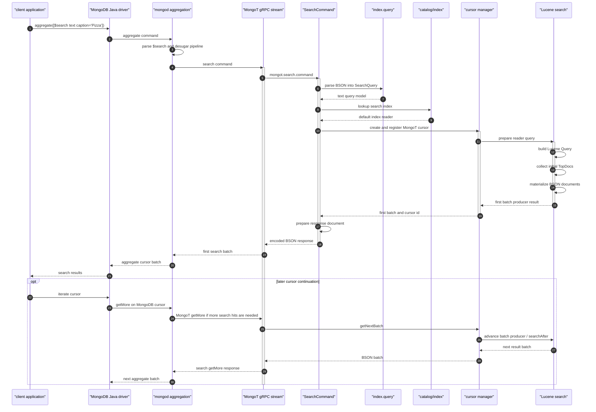

# Example #1 - Text Search

Let's start with a real example. Here's an Atlas Search query:

```javascript
db.image.aggregate([
  {
    $search: {
      text: {
        query: "Pizza",
        path: "caption"
      }
    }
  }
]);
```

The application sends that as an ordinary MongoDB `aggregate` command to `mongod`. The Java driver does not connect to MongoT directly. When `mongod` reaches the `$search` stage, it rewrites the public stage into an internal remote-search stage, builds a MongoT `search` command, and opens a remote cursor against MongoT.

Inside MongoT, the request lands on the gRPC command stream, dispatches to `SearchCommand`, resolves the search index, creates a cursor, builds the Lucene query, executes the initial Lucene search, materializes BSON results, and returns the first batch to `mongod`.

## Trace



## Breakdown Table

This table uses the measured text-only run from `load-results/breakdown-20260426-23/trace-breakdown-text-full-20260426-225217-01-text.md`. That run sampled 2,000 Jaeger traces for `mongodb.CommandService/atlasSearchCoco.image/search`. The median MongoT stream span was `8.913 ms`; the median initial `mongot.search.command` span was `890 us`.

| Phase | Main Span(s) | Median | Share of Command | Code Path | What It Means |
| --- | --- | ---: | ---: | --- | --- |
| Query context | `mongot.search.prepare_query_context` | 17 us | 1.91% | `SearchCommand.run`, query optimization flags, dynamic feature flags | Builds per-query execution context before parsing the request. |
| Parse BSON | `mongot.search.parse_query_bson`, `Query.fromBson` | 211 us | 23.71% | `SearchQuery.fromBson` | Converts the incoming MongoT `search` command into MongoT query model objects. |
| Index lookup | `mongot.search.lookup_index_catalog`, `mongot.search.resolve_index` | 3 us | 0.34% | `SearchCommand.getIndexFromCatalog` | Finds the named search index in MongoT's in-memory catalog. |
| Cursor setup | `mongot.cursor.*`, `mongot.search.create_and_register_cursor` | 46 us | 5.16% | `MongotCursorManagerImpl.newCursor`, `CursorFactory.createCursor`, `IndexCursorManagerImpl.createCursor` | Creates cursor state around the index reader and batch producer. |
| Build Lucene query | `mongot.lucene.build_query`, `mongot.lucene.create_search_query` | 37 us | 4.16% | `LuceneSearchQueryFactoryDistributor.createQuery`, `TextQueryFactory.createQuery` | Translates MongoT's query model into a Lucene `Query`. This is construction, not execution. |
| Lucene collect hits | `mongot.lucene.collect_initial_top_docs`, `mongot.lucene.initial_top_docs` | 92 us | 10.34% | `MeteredLuceneSearchManager.initialSearch`, `LuceneOperatorSearchManager.initialSearch` | Executes the initial Lucene text search and returns the first `TopDocs`. |
| Reader orchestration | `mongot.lucene.prepare_search_reader_query`, `mongot.lucene.search_index_reader.query` | 107 us | 12.02% | `LuceneSearchIndexReader.query`, `LuceneSearchIndexReader.collectorQuery` | Handles reader bookkeeping, stored-source checks, branch dispatch, and locking around Lucene execution. |
| Advance batch | `mongot.cursor.advance_batch_producer` | 12 us | 1.35% | `MongotCursor.getNextBatch`, `LuceneSearchBatchProducer.execute` | Advances the batch producer for the first batch; later getMore can use `searchAfter`. |
| Materialize BSON | `mongot.lucene.materialize_bson_documents`, `mongot.lucene.materialize_results` | 372 us | 41.80% | `LuceneSearchBatchProducer.getSearchResultsFromIter`, `ProjectStage.project`, `MetaIdRetriever.getRootMetaId` | Converts Lucene hits into BSON response documents, including stored-source or id/score output. |
| Batch orchestration | `mongot.search.load_first_cursor_batch` | 16 us | 1.80% | `MongotCursorManagerImpl.getNextBatch`, `IndexCursorManagerImpl.getNextBatch` | Wraps first-batch loading and cursor exhaustion checks. |
| Response document | `mongot.search.prepare_response_document` | 13 us | 1.46% | `SearchCommand.getBatch`, `MongotCursorBatch.toBson` | Builds the command response wrapper, cursor document, and metadata variables. |
| Encode BSON | `mongot.search.encode_response_bson`, `mongot.search.serialize_batch` | 1 us | 0.11% | `SearchCommand.getBatch`, `MongotCursorBatch.toBson` | Serializes the response payload returned on the command stream. |
| Stream lifecycle | `mongodb.CommandService/atlasSearchCoco.image/search` | 8.078 ms outside command | 90.63% of stream | `ServerCallHandler.onNext`, `ServerCallHandler.handleMessage`, `CommandManager` | gRPC stream lifetime outside the initial command span, including response observer handling, client consumption, cleanup, and any later cursor work in the same stream. |

## Runtime Reading

The important split is between the root stream span and the initial command span. The root span answers "how long did MongoT's command stream live?" The `mongot.search.command` span answers "what did MongoT do to produce the initial search response?"

For this text-search run, the initial command work was sub-millisecond at the median. BSON materialization was the largest command-phase segment at `372 us`, followed by BSON parsing at `211 us`, reader orchestration at `107 us`, and Lucene hit collection at `92 us`. The actual Lucene text search was visible, but it was not the dominant part of the command span for this stored-source text workload.

The generated chart for the same run is here:


