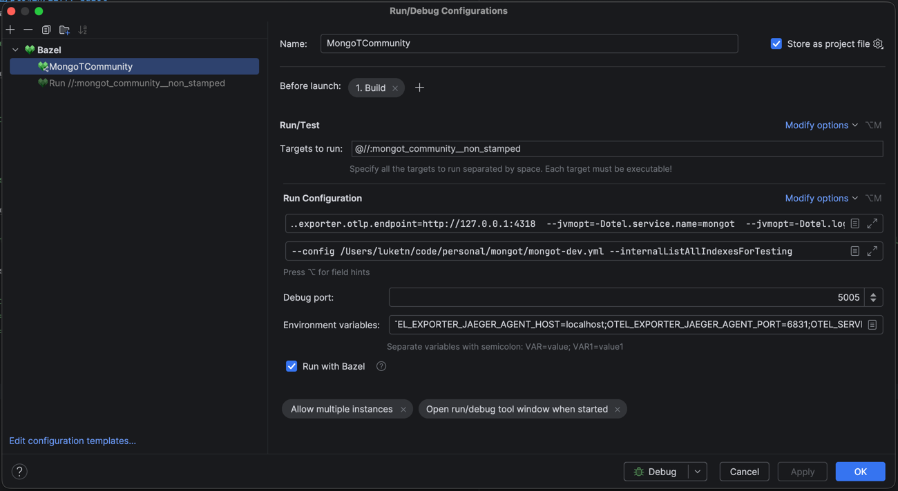

## IntelliJ QuickStart

Run the following to start mongod locally and configure mongot to talk to it:
```bash
./local-mongod.sh
```

Configure IntelliJ run config:  

1. Make sure you have the Bazel plugin installed and configured in IntelliJ
   https://plugins.jetbrains.com/plugin/22977-bazel
2. Add a Bazel target
Set the target to run to:
```
@//:mongot_community__non_stamped
```
3. Save the Run config, clicking OK
4. Open the Run config settings, and add the Program arguments:
```
--config /Users/luketn/code/personal/mongot/mongot-dev.yml --internalListAllIndexesForTesting
```

