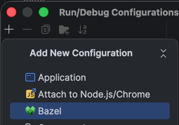
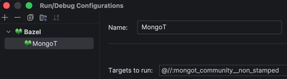
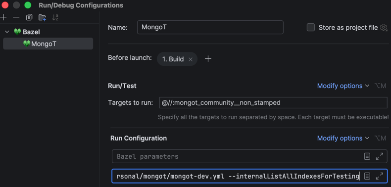
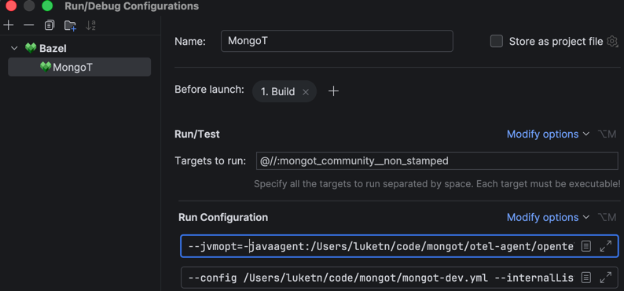
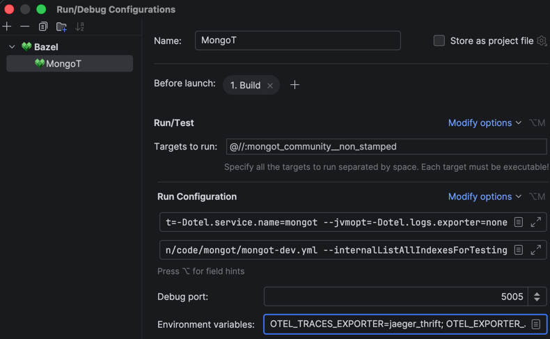

## IntelliJ QuickStart

Start the local infrastructure first (see [LOCAL-RUN.md](LOCAL-RUN.md) for full details):

```bash
./local-mongod.sh
./local-monitoring.sh
```

Configure IntelliJ run config:

1. Make sure you have the Bazel plugin installed and configured in IntelliJ
   https://plugins.jetbrains.com/plugin/22977-bazel
2. Edit Run Configurations and add a Bazel target. Set the target to run to:
```
@//:mongot_community__non_stamped
```


3. Save the Run config, clicking OK
4. Open the Run config settings, and add the Program arguments:
```
--config {full-path-to-source-dir}/mongot/mongot-dev.yml --internalListAllIndexesForTesting
```
e.g.
```
--config /Users/luketn/code/mongot/mongot-dev.yml --internalListAllIndexesForTesting
```

5. To enable distributed tracing, add these Bazel parameters:
```
--jvmopt=-javaagent:{full-path-to-source-dir}/otel-agent/opentelemetry-javaagent.jar --jvmopt=-Dotel.traces.exporter=otlp --jvmopt=-Dotel.exporter.otlp.endpoint=http://127.0.0.1:4318 --jvmopt=-Dotel.service.name=mongot --jvmopt=-Dotel.logs.exporter=none
```
e.g.
```
--jvmopt=-javaagent:/Users/luketn/code/mongot/otel-agent/opentelemetry-javaagent.jar --jvmopt=-Dotel.traces.exporter=otlp --jvmopt=-Dotel.exporter.otlp.endpoint=http://127.0.0.1:4318 --jvmopt=-Dotel.service.name=mongot --jvmopt=-Dotel.logs.exporter=none
```

6. Set the environment variables:
```
OTEL_TRACES_EXPORTER=jaeger_thrift;
OTEL_EXPORTER_JAEGER_AGENT_HOST=localhost;
OTEL_EXPORTER_JAEGER_AGENT_PORT=6831;
OTEL_SERVICE_NAME=mongot;
```
