# MongoT Runtime Timeline

This timeline is derived from the package tour plus the actual bootstrap, config, lifecycle, replication, cursor, and server code paths.

Arrows are package-level flows, backed by representative classes such as:

- `community`: `MongotCommunity`, `CommunityMongotBootstrapper`
- `config`: `DefaultConfigManager`, `CommunityConfigUpdater`, `PeriodicConfigMonitor`
- `lifecycle`: `DefaultLifecycleManager`, `IndexLifecycleManager`
- `replication`: `MongoDbReplicationManager`, `ReplicationIndexManager`, `InitialSyncQueue`, `ChangeStreamManager`
- `server`: `GrpcStreamingServer`, `ServerCallHandler`, `SearchCommand`, `VectorSearchCommand`
- `cursor`: `MongotCursorManagerImpl`, `IndexCursorManagerImpl`, `CursorFactory`
- `index`: initialized index creation plus Lucene-backed readers/writers
- `catalogservice`: authoritative catalog and metadata service

The startup, indexing, steady-state, and shutdown flows below are grounded in code. The later Atlas Search and Vector Search load stages are modeled from the serving paths so their different dependencies stay visible in the graph, not from a captured production trace.

## 1. Bootstrap, Control Plane, and Service Initialization

This diagram is entirely inside the `mongot` executable. MongoT starts by letting `community` hand control to `config`, which fans out into logging, metrics, monitors, metadata, cursors, and serving infrastructure.

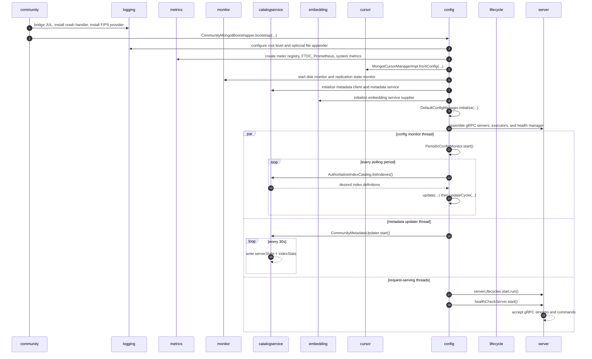

## 2. Initialize, Initial Sync, and Transition to Steady State

This diagram is entirely inside the `mongot` executable. Once the process is up, lifecycle and replication cooperate to initialize indexes, establish durable resume state, and move each generation into steady service.

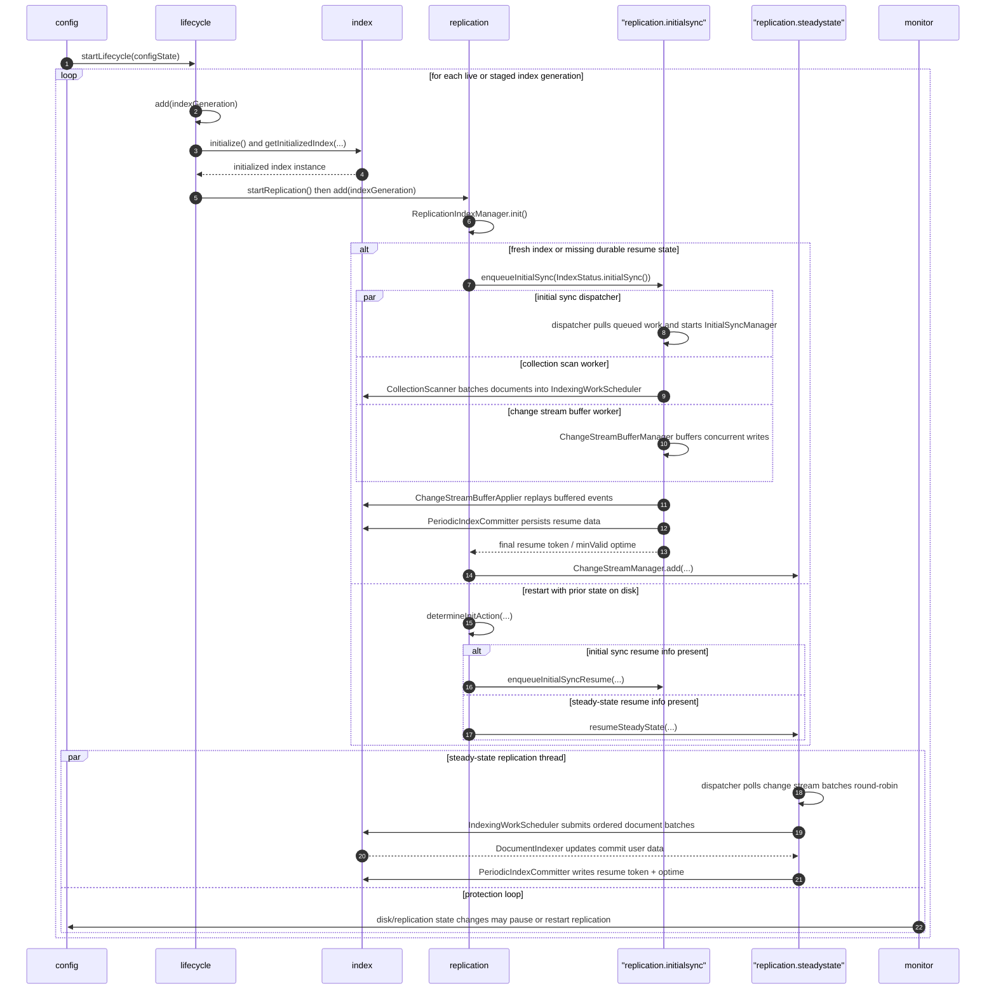

## 3. Stable Serving: Atlas Search, Vector Search, and Cursor Continuations

This diagram is entirely inside the `mongot` executable. Stable serving splits into two distinct query paths: Atlas Search uses the server-cursor-index chain, while Vector Search adds the embedding service before the index reader.

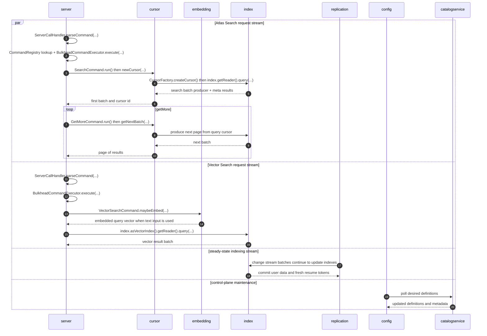

## 4. Shutdown

This diagram is entirely inside the `mongot` executable. Shutdown unwinds the same stack in reverse order so serving, telemetry, config, lifecycle, and replication all stop cleanly without orphaned work.

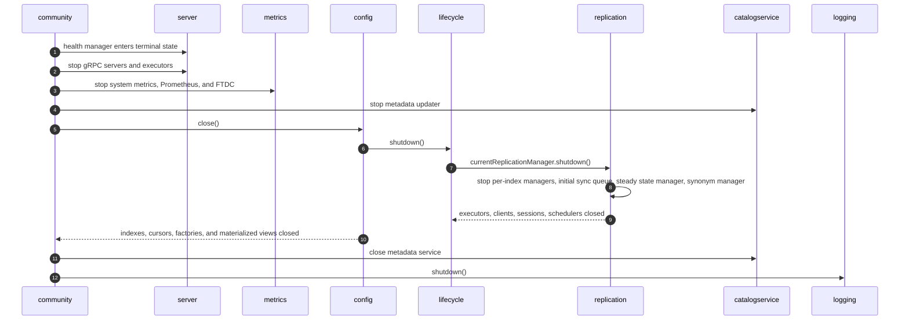

## 5. Detailed Trace and Load Test Views

The diagrams below add the runtime detail learned from the Atlas Search Coco load-test runs captured with `DETAILED_TRACE_SPANS=true`. The broad package flows above show ownership and lifecycle; these diagrams show the shape of individual traced requests and update batches.

### 5.1 Text Search Trace

Text search uses the command-stream path, then creates a cursor backed by a Lucene search batch producer. In the measured text-only run, the median root stream span was `8.9 ms` and the median initial `mongot.search.command` span was `890 us`.

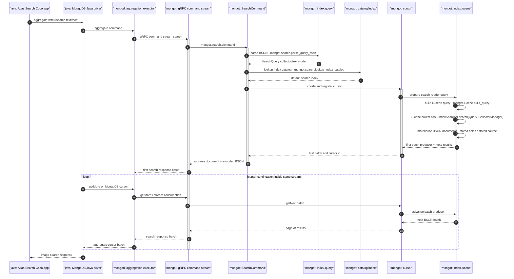

### 5.2 Vector Search Trace

Vector search follows the same command-stream skeleton but the dominant command-phase work is vector candidate collection over the `vector_caption` index and `captionEmbedding` vector field. In the measured vector-only run, the median root stream span was `10.0 ms`, the command span was `2.8 ms`, and vector candidate collection was about `1.9 ms` median.

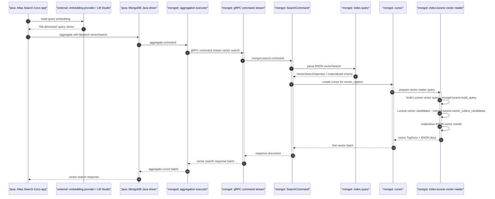

### 5.3 Combined Text And Vector With `$rankFusion`

The combined workload is not one monolithic MongoT search. The Java app builds a `$rankFusion` aggregation, and MongoT sees separate search streams for the text and vector sub-pipelines. The two sub-pipelines share the same root operation name, so `mongot.search.index.name` is the attribute that separates `default` from `vector_caption` traces.

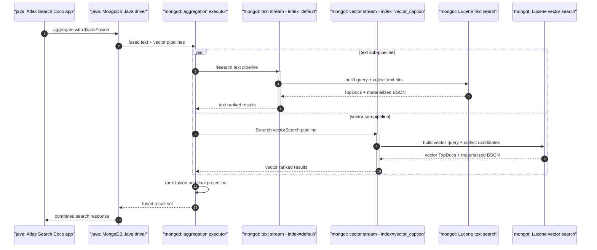

Measured component split from the combined run:

| Sub-pipeline | Index | Stream Median | Command Median | Runtime Signal |
| --- | --- | ---: | ---: | --- |
| Text | `default` | 15.1 ms | 851 us | Text/facet query, Lucene text hit collection, BSON materialization. |
| Vector | `vector_caption` | 24.2 ms | 4.3 ms | Exact vector candidate collection dominates command time. |

### 5.4 Text Search With License Fields

The license-fields workload uses text search, but `includeLicense=true` changes which fields the Java app asks MongoDB to return. This is not the Java MongoDB driver receiving a batch of `_id`s from MongoT and issuing a second client-side query. The Java driver builds one `aggregate` command, sends it to `mongod`, and then iterates the MongoDB cursor with normal `getMore` commands when more result batches are needed.

The `_id` handoff is server-side. When `$search` is not using `returnStoredSource`, MongoT's Lucene projection path uses `IdLookupFactory`: it returns each hit's root `_id` and leaves `storedSource` empty. The mongod-side search pipeline then uses those ids to perform the internal id-lookup/materialization from the MongoDB collection before the final aggregation projection is returned to the driver. MongoT itself is not opening a separate query back to mongod for the license fields.

So "app projection / license fields" means the application-level response projection now requires `licenseName` and `licenseUrl`, which are outside the stored-source-only response shape used by the lighter workload. That forces full-document materialization inside MongoDB's aggregation/search execution path. The measured effect was mostly outside the initial MongoT command span: HTTP and app-reported MongoDB time increased, while the median `mongot.search.command` stayed around `863 us`.

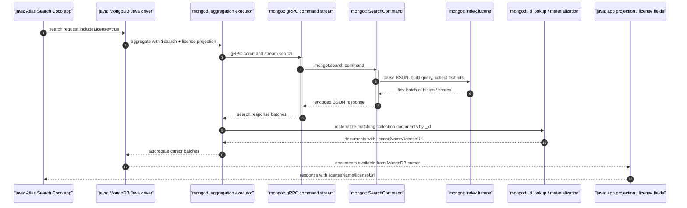

### 5.5 Async Insert/Delete Indexing Trace

Insert/delete API calls do not become children of the client request trace inside MongoT. The client writes to MongoDB, then MongoT observes the write asynchronously through change streams and updates Lucene in background indexing traces. The clean mutation run used paired synthetic inserts/deletes and produced 5,662 inserts plus 5,662 deletes.

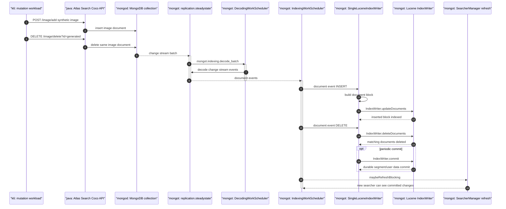

Measured mutation medians:

| Span | Median | Meaning |
| --- | ---: | --- |
| `mongot.indexing.change_stream_batch` | 299.5 us | Receives change stream batch for the index generation. |
| `mongot.indexing.batch` | 146 us | Runs scheduled indexing batch. |
| `mongot.indexing.document_event` INSERT | 168 us | Routes insert/update document event into Lucene writer. |
| `mongot.lucene.index_writer.update_documents` | 54 us | Actual Lucene `IndexWriter.updateDocuments` call. |
| `mongot.lucene.index_writer.delete_documents` | 3 us | Actual Lucene `IndexWriter.deleteDocuments` call. |
| `mongot.lucene.index_writer.commit` | 20.3 ms | Periodic Lucene commit when observed. |

### 5.6 Trace Hierarchy And Accounted Time

This diagram is entirely inside the `mongot` executable. The most important tracing lesson is that the root stream span and the initial command span answer different questions. The stream span represents end-to-end MongoT stream lifetime. The command span explains the initial command's internal work. Later cursor/getMore and client stream consumption can sit under the root stream but outside `mongot.search.command`.

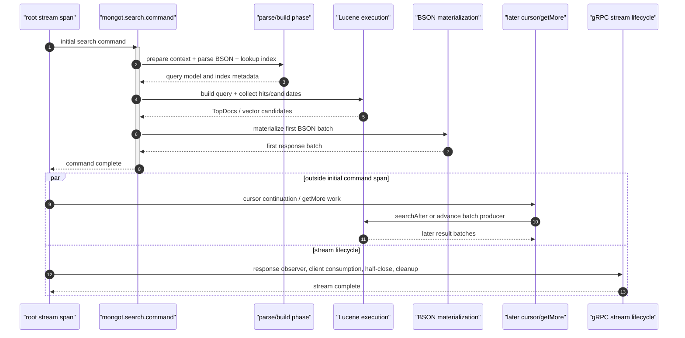

### 5.7 Measured Scenario Comparison

This flowchart is a compact view of what changed across the load-test scenarios. It is not a call graph; it is a performance map from the 2026-04-26 trace breakdowns.

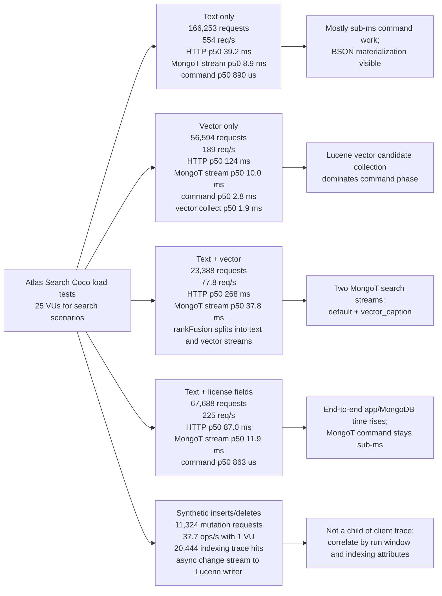

## Animation Scenario

The tour app animation should treat this as a compressed runtime story with multiple concurrent streams:

| Virtual Time | Phase | Main Streams |
| --- | --- | --- |
| `0s-6s` | Bootstrap | `community -> config -> metrics/monitor/catalogservice/cursor/server` |
| `6s-18s` | Initialize | `config -> lifecycle -> index -> replication` |
| `18s-34s` | Initial sync | `replication.initialsync -> index` plus buffered write capture |
| `34s-44s` | Stable state | `replication.steadystate -> index` with config and metadata polling in the background |
| `44s-59s` | Atlas Search load | `server -> cursor -> index` Atlas Search flow with steady-state replication continuing behind it |
| `59s-74s` | Vector Search load | `server -> embedding -> index` Vector Search flow with steady-state replication continuing behind it |
| `74s-78s` | Atlas Search taper | The Atlas Search path remains active, but at visibly reduced intensity |
| `78s-82s` | Vector Search taper | The Vector Search path remains active, but at visibly reduced intensity |
| `82s-90s` | Shutdown | `community -> server/metrics/config -> lifecycle -> replication -> catalogservice/logging` |

### Edge Groups to Animate

- Bootstrap and initialize:
  - `community -> config`
  - `config -> metrics`
  - `config -> monitor`
  - `config -> catalogservice`
  - `config -> cursor`
  - `config -> server`
  - `config -> lifecycle`
- Index creation and initial replication:
  - `lifecycle -> index`
  - `lifecycle -> replication`
  - `replication -> index`
- Stable state:
  - `config -> catalogservice`
  - `catalogservice -> config`
  - `replication -> index`
  - `monitor -> config`
- Atlas Search load:
  - `server -> cursor`
  - `cursor -> index`
- Vector Search load:
  - `server -> embedding`
  - `embedding -> index`
- Shutdown:
  - `community -> server`
  - `community -> metrics`
  - `community -> config`
  - `config -> lifecycle`
  - `lifecycle -> replication`
  - `community -> catalogservice`
  - `community -> logging`

### Notes

- The package graph is import-oriented, so a few animation edges represent runtime call direction rather than the static import arrow direction.
- The steady-state and config-monitor streams are genuinely concurrent in code.
- The `44s-74s` query-load window is intentionally split into separate Atlas Search and Vector Search slices so the visualization can show the Lucene/cursor path and the embedding/vector path independently.
