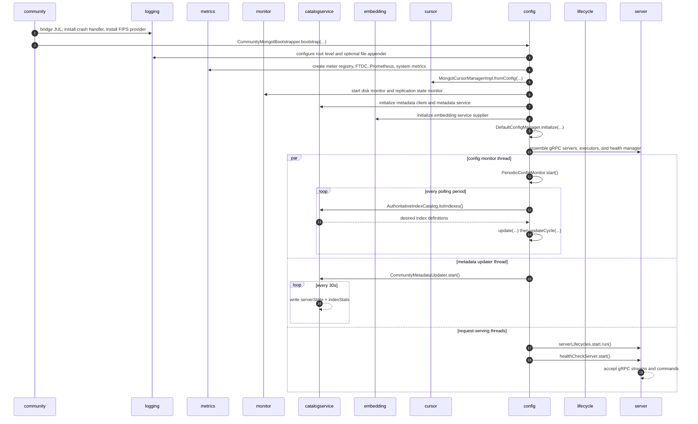
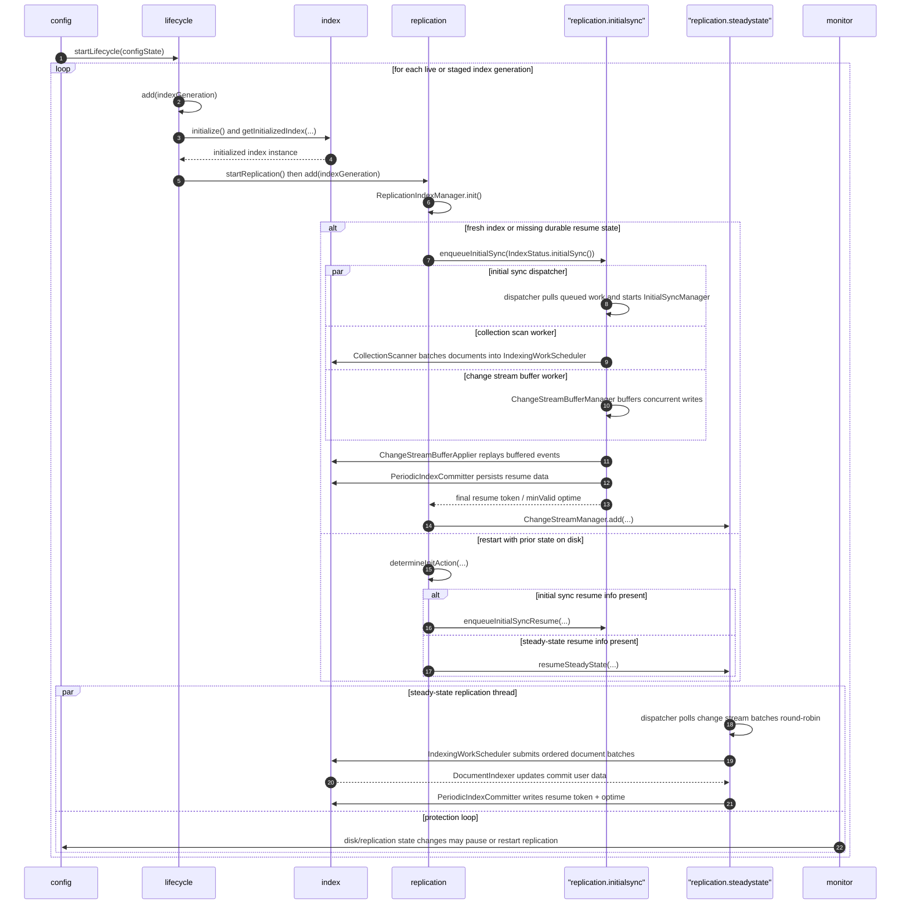
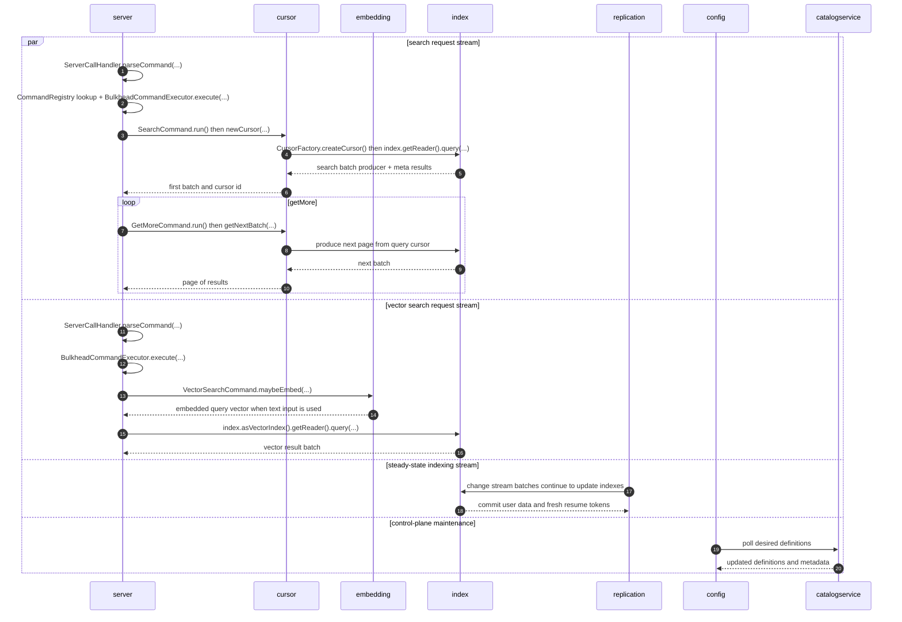
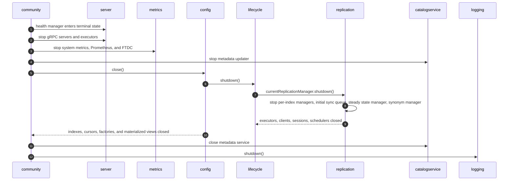

# MongoT Runtime Timeline

This timeline is derived from the package tour plus the actual bootstrap, config, lifecycle, replication, cursor, and server code paths.

Arrows are package-level flows, backed by representative classes such as:

- `community`: `MongotCommunity`, `CommunityMongotBootstrapper`
- `config`: `DefaultConfigManager`, `CommunityConfigUpdater`, `PeriodicConfigMonitor`
- `lifecycle`: `DefaultLifecycleManager`, `IndexLifecycleManager`
- `replication`: `MongoDbReplicationManager`, `ReplicationIndexManager`, `InitialSyncQueue`, `ChangeStreamManager`
- `server`: `GrpcStreamingServer`, `ServerCallHandler`, `SearchCommand`, `VectorSearchCommand`
- `cursor`: `MongotCursorManagerImpl`, `IndexCursorManagerImpl`, `CursorFactory`
- `index`: initialized index creation plus Lucene-backed readers/writers
- `catalogservice`: authoritative catalog and metadata service

The startup, indexing, steady-state, and shutdown flows below are grounded in code. The later "high-volume query burst for 30s" section is a modeled scenario inferred from the serving paths, not a captured production trace.

## 1. Bootstrap, Control Plane, and Service Bring-Up

## 2. Index Bring-Up, Initial Sync, and Transition to Steady State

## 3. Stable Serving: Search, Vector Search, and Cursor Continuations

## 4. Shutdown

## Animation Scenario

The tour app animation should treat this as a compressed runtime story with multiple concurrent streams:

| Virtual Time | Phase | Main Streams |
| --- | --- | --- |
| `0s-6s` | Bootstrap | `community -> config -> metrics/monitor/catalogservice/cursor/server` |
| `6s-18s` | Index bring-up | `config -> lifecycle -> index -> replication` |
| `18s-34s` | Initial sync | `replication.initialsync -> index` plus buffered write capture |
| `34s-44s` | Stable state | `replication.steadystate -> index` with config and metadata polling in the background |
| `44s-74s` | High-volume query burst | Parallel `server -> cursor -> index` search flow and `server -> embedding -> index` vector flow, while steady-state replication continues |
| `74s-82s` | Traffic taper | Same serving edges, but at visibly reduced intensity |
| `82s-90s` | Shutdown | `community -> server/metrics/config -> lifecycle -> replication -> catalogservice/logging` |

### Edge Groups to Animate

- Bootstrap and bring-up:
  - `community -> config`
  - `config -> metrics`
  - `config -> monitor`
  - `config -> catalogservice`
  - `config -> cursor`
  - `config -> server`
  - `config -> lifecycle`
- Index creation and initial replication:
  - `lifecycle -> index`
  - `lifecycle -> replication`
  - `replication -> index`
- Stable state:
  - `config -> catalogservice`
  - `catalogservice -> config`
  - `replication -> index`
  - `monitor -> config`
- Query load:
  - `server -> cursor`
  - `cursor -> index`
  - `server -> embedding`
  - `embedding -> index`
- Shutdown:
  - `community -> server`
  - `community -> metrics`
  - `community -> config`
  - `config -> lifecycle`
  - `lifecycle -> replication`
  - `community -> catalogservice`
  - `community -> logging`

### Notes

- The package graph is import-oriented, so a few animation edges represent runtime call direction rather than the static import arrow direction.
- The steady-state and config-monitor streams are genuinely concurrent in code.
- The `44s-74s` burst is intentionally modeled as a 30-second workload window so the visualization can show sustained search and vector traffic over a stable replicated index.
