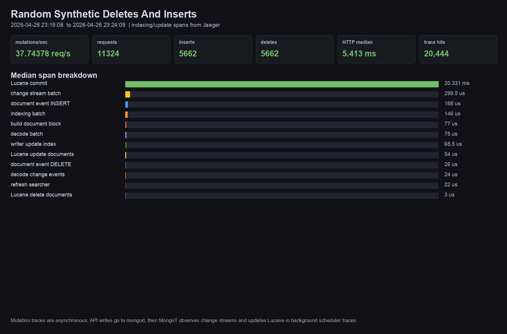

# MongoT Trace Breakdown: Random Synthetic Deletes And Inserts

Run window: 2026-04-26 23:19:08  to 2026-04-26 23:24:09 .

Command:

```sh
k6 run -e K6_VUS=see-run-env -e K6_DURATION=see-run-env -e K6_MUTATION_MODE=paired k6-mutations.js
```

Scenario:

A separate k6 workload drives /image/add and /image/delete through the Coco API using synthetic images. It inserts only generated documents and deletes those generated ids, so the COCO dataset is not intentionally modified.



## Run Summary

| Metric | Value |
| --- | ---: |
| mutation requests | 11324 |
| mutation throughput | 37.74378 req/s |
| inserts | 5662 |
| deletes | 5662 |
| failures | 0.00%   0 out of 11324 |
| HTTP median | 5.413 ms |
| HTTP p95 | 10.32255 ms |
| indexing trace hits | 20,444 |

## Trace Segments

| Segment | Median | Spans observed | Traces matched | Span(s) | Code | Description |
| --- | ---: | ---: | ---: | --- | --- | --- |
| change stream batch | 299.5 us | 2000 | 2000 | `mongot.indexing.change_stream_batch` | [DecodingExecutorChangeStreamIndexManager](../../src/main/java/com/xgen/mongot/replication/mongodb/steadystate/changestream/DecodingExecutorChangeStreamIndexManager.java#L151) | Receives a MongoDB change stream batch for an index generation and records resume/lifecycle metadata. |
| decode batch | 75 us | 2000 | 2000 | `mongot.indexing.decode_batch` | [DecodingWorkScheduler.run](../../src/main/java/com/xgen/mongot/replication/mongodb/common/DecodingWorkScheduler.java#L146) | Moves raw change stream work into the decoding scheduler and preserves tracing context for downstream indexing work. |
| decode change events | 24 us | 2000 | 2000 | `mongot.indexing.decode_change_stream_events` | [DecodingExecutorChangeStreamIndexManager.decodeBatch](../../src/main/java/com/xgen/mongot/replication/mongodb/steadystate/changestream/DecodingExecutorChangeStreamIndexManager.java#L169) | Decodes MongoDB change stream events into MongoT document events and records witnessed/applicable counts. |
| indexing batch | 146 us | 2000 | 2000 | `mongot.indexing.batch` | [IndexingWorkScheduler.run](../../src/main/java/com/xgen/mongot/replication/mongodb/common/IndexingWorkScheduler.java#L159)<br>[DefaultIndexingWorkScheduler.getBatchTasksFuture](../../src/main/java/com/xgen/mongot/replication/mongodb/common/DefaultIndexingWorkScheduler.java#L34) | Runs an indexing scheduler batch after decoding. This is the bridge from MongoDB change events into index writer mutations. |
| document event INSERT | 168 us | 1000 | 2000 | `mongot.indexing.document_event` | [IndexingWorkScheduler.DocumentEventTask.run](../../src/main/java/com/xgen/mongot/replication/mongodb/common/IndexingWorkScheduler.java#L374)<br>[SingleLuceneIndexWriter.updateIndex](../../src/main/java/com/xgen/mongot/index/lucene/writer/SingleLuceneIndexWriter.java#L332) | Processes one insert/update document event before converting it into Lucene index writer operations. |
| document event DELETE | 26 us | 1000 | 2000 | `mongot.indexing.document_event` | [IndexingWorkScheduler.DocumentEventTask.run](../../src/main/java/com/xgen/mongot/replication/mongodb/common/IndexingWorkScheduler.java#L374)<br>[SingleLuceneIndexWriter.updateIndex](../../src/main/java/com/xgen/mongot/index/lucene/writer/SingleLuceneIndexWriter.java#L332) | Processes one delete document event before calling the Lucene delete path. |
| writer update index | 65.5 us | 2000 | 2000 | `mongot.lucene.index_writer.update_index` | [SingleLuceneIndexWriter.updateIndex](../../src/main/java/com/xgen/mongot/index/lucene/writer/SingleLuceneIndexWriter.java#L332) | Top-level per-document Lucene writer mutation wrapper. It routes insert/update/delete events to document block construction, updateDocuments, or deleteDocuments. |
| build document block | 77 us | 2000 | 2000 | `mongot.lucene.index_writer.build_document_block` | [SingleLuceneIndexWriter.updateIndex](../../src/main/java/com/xgen/mongot/index/lucene/writer/SingleLuceneIndexWriter.java#L332)<br>[document block build span](../../src/main/java/com/xgen/mongot/index/lucene/writer/SingleLuceneIndexWriter.java#L597) | Converts MongoDB BSON fields into the Lucene document block for indexed and stored fields. |
| Lucene update documents | 54 us | 2000 | 2000 | `mongot.lucene.index_writer.update_documents` | [SingleLuceneIndexWriter.updateIndex](../../src/main/java/com/xgen/mongot/index/lucene/writer/SingleLuceneIndexWriter.java#L332)<br>[IndexWriter.updateDocuments call](../../src/main/java/com/xgen/mongot/index/lucene/writer/SingleLuceneIndexWriter.java#L643) | Invokes Lucene [`IndexWriter.updateDocuments`](https://lucene.apache.org/core/9_11_1/core/org/apache/lucene/index/IndexWriter.html#updateDocuments(org.apache.lucene.index.Term,java.lang.Iterable)) to atomically replace the document block for the synthetic inserted document. |
| Lucene delete documents | 3 us | 2000 | 2000 | `mongot.lucene.index_writer.delete_documents` | [SingleLuceneIndexWriter.updateIndex](../../src/main/java/com/xgen/mongot/index/lucene/writer/SingleLuceneIndexWriter.java#L332)<br>[IndexWriter.deleteDocuments call](../../src/main/java/com/xgen/mongot/index/lucene/writer/SingleLuceneIndexWriter.java#L567) | Invokes Lucene [`IndexWriter.deleteDocuments`](https://lucene.apache.org/core/9_11_1/core/org/apache/lucene/index/IndexWriter.html#deleteDocuments(org.apache.lucene.index.Term...)) to delete documents matching the MongoDB document id term. |
| Lucene commit | 20.331 ms | 6 | 6 | `mongot.lucene.index_writer.commit` | [SingleLuceneIndexWriter.commit](../../src/main/java/com/xgen/mongot/index/lucene/writer/SingleLuceneIndexWriter.java#L349)<br>[IndexWriter.commit call](../../src/main/java/com/xgen/mongot/index/lucene/writer/SingleLuceneIndexWriter.java#L363) | Commits writer changes and user data through Lucene [`IndexWriter.commit`](https://lucene.apache.org/core/9_11_1/core/org/apache/lucene/index/IndexWriter.html#commit()). This can happen on a periodic schedule rather than in the exact same trace as the API request. |
| refresh searcher | 22 us | 438 | 438 | `mongot.lucene.maybe_refresh_searcher_manager` | [PeriodicLuceneIndexRefresher.run](../../src/main/java/com/xgen/mongot/index/lucene/PeriodicLuceneIndexRefresher.java#L93) | Refreshes the Lucene searcher manager so newly committed index changes become visible to searchers. This uses Lucene [`SearcherManager`](https://lucene.apache.org/core/9_11_1/core/org/apache/lucene/search/SearcherManager.html) refresh behavior. |

## Notes

Insert/delete API calls do not become children of a single client trace inside MongoT, because the API writes land in MongoDB first. MongoT then observes those writes through steady-state change streams. The useful correlation is therefore by run window, namespace/index generation attributes, `mongot.indexing.event.type`, and the Lucene writer spans emitted by the background indexing scheduler.

The paired mutation script inserts a synthetic image and deletes that same generated id, so it exercises insert and delete update paths without intentionally deleting COCO source records.
