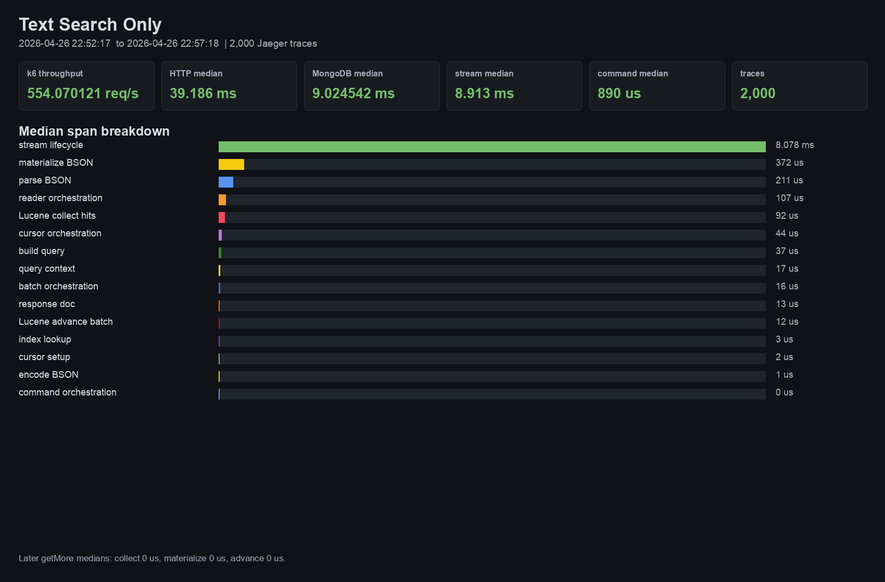

# MongoT Trace Breakdown: Text Search Only

Run window: 2026-04-26 22:52:17  to 2026-04-26 22:57:18 .

Command:

```sh
k6 run -e K6_VUS=see run env -e K6_DURATION=see run env -e SEARCH_TYPE=text -e INCLUDE_LICENSE=false k6.js
```

Scenario:

Coco sends a text-only /image/search request. The Java app builds an aggregation with a $search facet collector, a compound text clause over caption, optional facet filters, stored-source response projection, and a final response facet.



## Run Summary

| Metric | Value |
| --- | ---: |
| k6 requests | 166253 |
| k6 throughput | 554.070121 req/s |
| k6 failures | 0.00%   0 out of 166253 |
| HTTP median | 39.186 ms |
| HTTP p95 | 71.7676 ms |
| App-reported MongoDB median | 9.024542 ms |
| App-reported MongoDB p95 | 39.71365 ms |
| App Java non-Mongo median | 2.457 ms |
| Jaeger traces sampled | 2,000 |
| Root trace operation | `mongodb.CommandService/atlasSearchCoco.image/search` |
| Median stream span | 8.913 ms |
| Median `mongot.search.command` | 890 us |

## Representative Trace Attributes

| Attribute | Value |
| --- | --- |
| Trace id | `0cbb27d1775b03503e1b428a4cef1029` |
| Operation id | `0cbb27d1775b03503e1b428a4cef1029` |
| Search index | `default` |
| Query type | `collector` |
| Lucene query class | `org.apache.lucene.search.BooleanQuery` |
| Lucene query | `#IndexOrDocValuesQuery(indexQuery=ConstantScore($type:token/sports:snowboard), dvQuery=$type:token/sports:[[73 6e 6f 77 62 6f 61 72 64] TO [73 6e 6f 77 62 6f 61 72 64]]) +$type:string/caption:skiers` |
| Reader docs / segments | 118291 docs / 6 segments |
| Vector limit / type |  /  |
| Result samples attached | 2 |

## Trace Segments

| Segment | Median | Share | Span(s) | Code | Description |
| --- | ---: | ---: | --- | --- | --- |
| query context | 17 us | 1.91% of command | `mongot.search.prepare_query_context` | [SearchCommand.run](../../src/main/java/com/xgen/mongot/server/command/search/SearchCommand.java#L129)<br>[OptimizationFlagsDefinition.toQueryOptimizationFlags](../../src/main/java/com/xgen/mongot/server/command/search/definition/request/OptimizationFlagsDefinition.java#L31)<br>[DynamicFeatureFlagRegistry.evaluateClusterInvariant](../../src/main/java/com/xgen/mongot/featureflag/dynamic/DynamicFeatureFlagRegistry.java#L128) | Prepares per-query execution flags and feature-flag state before BSON parsing. This is in-memory control-plane work. |
| parse BSON | 211 us | 23.71% of command | `mongot.search.parse_query_bson`, `mongot.search.parse_query`, `Query.fromBson` | [SearchCommand.run](../../src/main/java/com/xgen/mongot/server/command/search/SearchCommand.java#L129)<br>[SearchQuery.fromBson](../../src/main/java/com/xgen/mongot/index/query/SearchQuery.java#L171)<br>[Query.fromBson span](../../src/main/java/com/xgen/mongot/index/query/SearchQuery.java#L176) | Converts the incoming BSON $search command into MongoT query model objects. This parses text, vectorSearch, compound, facet, and filter clauses before any Lucene execution. |
| index lookup | 3 us | 0.34% of command | `mongot.search.lookup_index_catalog`, `mongot.search.resolve_index` | [SearchCommand.getIndexFromCatalog](../../src/main/java/com/xgen/mongot/server/command/search/SearchCommand.java#L477) | Looks up the named search index in MongoT's in-memory catalog and records whether the index and partitions are available. |
| cursor setup | 2 us | 0.22% of command | `mongot.cursor.select_index_manager`, `mongot.cursor.choose_batch_size`, `mongot.cursor.instantiate_cursor`, `mongot.cursor.register_active_cursor`, `mongot.cursor.register_index_mapping` | [MongotCursorManagerImpl.newCursor](../../src/main/java/com/xgen/mongot/cursor/MongotCursorManagerImpl.java#L130)<br>[CursorFactory.createCursor](../../src/main/java/com/xgen/mongot/cursor/CursorFactory.java#L57)<br>[IndexCursorManagerImpl.createCursor](../../src/main/java/com/xgen/mongot/cursor/IndexCursorManagerImpl.java#L83) | Creates and registers cursor state around the index reader and batch producer. |
| cursor orchestration | 44 us | 4.94% of command | `mongot.search.create_and_register_cursor` | [MongotCursorManagerImpl.newCursor](../../src/main/java/com/xgen/mongot/cursor/MongotCursorManagerImpl.java#L130)<br>[CursorFactory.createCursor](../../src/main/java/com/xgen/mongot/cursor/CursorFactory.java#L57)<br>[IndexCursorManagerImpl.createCursor](../../src/main/java/com/xgen/mongot/cursor/IndexCursorManagerImpl.java#L83) | Residual cursor creation work: locks, availability checks, manager handoff, and cursor lifecycle wiring. |
| build query | 37 us | 4.16% of command | `mongot.lucene.build_query`, `mongot.lucene.create_search_query` | [LuceneSearchQueryFactoryDistributor.createQuery](../../src/main/java/com/xgen/mongot/index/lucene/query/LuceneSearchQueryFactoryDistributor.java#L229)<br>[TextQueryFactory.createQuery](../../src/main/java/com/xgen/mongot/index/lucene/query/TextQueryFactory.java#L125)<br>[VectorSearchQueryFactory.query](../../src/main/java/com/xgen/mongot/index/lucene/query/VectorSearchQueryFactory.java#L304) | Converts MongoT query objects into Lucene [`Query`](https://lucene.apache.org/core/9_11_1/core/org/apache/lucene/search/Query.html) objects. The span stores the Lucene query representation, class, size, hash, and truncation flag. This constructs the Lucene query tree but does not execute it. |
| Lucene collect hits | 92 us | 10.34% of command | `mongot.lucene.collect_initial_top_docs`, `mongot.lucene.initial_top_docs` | [MeteredLuceneSearchManager.initialSearch](../../src/main/java/com/xgen/mongot/index/lucene/MeteredLuceneSearchManager.java#L30)<br>[LuceneOperatorSearchManager.initialSearch](../../src/main/java/com/xgen/mongot/index/lucene/LuceneOperatorSearchManager.java#L34)<br>[AbstractLuceneSearchManager.createCollectorManager](../../src/main/java/com/xgen/mongot/index/lucene/AbstractLuceneSearchManager.java#L59) | Executes the initial Lucene text/facet search through [`IndexSearcher.search(Query, CollectorManager)`](https://lucene.apache.org/core/9_11_1/core/org/apache/lucene/search/IndexSearcher.html#search(org.apache.lucene.search.Query,org.apache.lucene.search.CollectorManager)). Lucene walks index segments, scores matches, and returns [`TopDocs`](https://lucene.apache.org/core/9_11_1/core/org/apache/lucene/search/TopDocs.html) for the first page. |
| reader orchestration | 107 us | 12.02% of command | `mongot.lucene.prepare_search_reader_query`, `mongot.lucene.search_index_reader.query` | [LuceneSearchIndexReader.query](../../src/main/java/com/xgen/mongot/index/lucene/LuceneSearchIndexReader.java#L250)<br>[LuceneSearchIndexReader.collectorQuery](../../src/main/java/com/xgen/mongot/index/lucene/LuceneSearchIndexReader.java#L672) | Residual work in the reader query path: stored-source checks, query branch dispatch, shared lock acquisition, and reader bookkeeping. |
| Lucene advance batch | 12 us | 1.35% of command | `mongot.cursor.advance_batch_producer` | [MongotCursor.getExplainDisabledNextBatch](../../src/main/java/com/xgen/mongot/cursor/MongotCursor.java#L90)<br>[LuceneSearchBatchProducer.execute](../../src/main/java/com/xgen/mongot/index/lucene/LuceneSearchBatchProducer.java#L170)<br>[AbstractLuceneSearchManager.getMoreTopDocs](../../src/main/java/com/xgen/mongot/index/lucene/AbstractLuceneSearchManager.java#L33) | Advances the batch producer. Later getMore calls may invoke Lucene [`IndexSearcher.searchAfter`](https://lucene.apache.org/core/9_11_1/core/org/apache/lucene/search/IndexSearcher.html#searchAfter(org.apache.lucene.search.ScoreDoc,org.apache.lucene.search.Query,int)) to continue from the previous [`ScoreDoc`](https://lucene.apache.org/core/9_11_1/core/org/apache/lucene/search/ScoreDoc.html). |
| materialize BSON | 372 us | 41.80% of command | `mongot.lucene.materialize_bson_documents`, `mongot.lucene.materialize_results` | [LuceneSearchBatchProducer.getSearchResultsFromIter](../../src/main/java/com/xgen/mongot/index/lucene/LuceneSearchBatchProducer.java#L299)<br>[ProjectStage.project](../../src/main/java/com/xgen/mongot/index/lucene/query/pushdown/project/ProjectStage.java#L35)<br>[MetaIdRetriever.getRootMetaId](../../src/main/java/com/xgen/mongot/index/lucene/query/util/MetaIdRetriever.java#L34) | Converts Lucene hits into BSON response documents, including stored-source or document-field materialization and sampled result payload attributes. Stored-source paths use Lucene [`IndexReader.storedFields()`](https://lucene.apache.org/core/9_11_1/core/org/apache/lucene/index/IndexReader.html#storedFields()) and [`StoredFields.document`](https://lucene.apache.org/core/9_11_1/core/org/apache/lucene/index/StoredFields.html#document(int)). |
| batch orchestration | 16 us | 1.80% of command | `mongot.search.load_first_cursor_batch` | [MongotCursorManagerImpl.getNextBatch](../../src/main/java/com/xgen/mongot/cursor/MongotCursorManagerImpl.java#L226)<br>[IndexCursorManagerImpl.getNextBatch](../../src/main/java/com/xgen/mongot/cursor/IndexCursorManagerImpl.java#L150)<br>[MongotCursor.getNextBatch](../../src/main/java/com/xgen/mongot/cursor/MongotCursor.java#L67) | Residual first-batch loading work around producer advancement, materialization, cursor state, and exhaustion checks. |
| response doc | 13 us | 1.46% of command | `mongot.search.prepare_response_document` | [SearchCommand.getBatch](../../src/main/java/com/xgen/mongot/server/command/search/SearchCommand.java#L317)<br>[MongotCursorBatch.toBson](../../src/main/java/com/xgen/mongot/cursor/serialization/MongotCursorBatch.java#L100) | Builds the command response wrapper, cursor result, metadata variables, and batch bookkeeping. |
| encode BSON | 1 us | 0.11% of command | `mongot.search.encode_response_bson`, `mongot.search.serialize_batch` | [SearchCommand.getBatch](../../src/main/java/com/xgen/mongot/server/command/search/SearchCommand.java#L317)<br>[MongotCursorBatch.toBson](../../src/main/java/com/xgen/mongot/cursor/serialization/MongotCursorBatch.java#L100) | Serializes the response document into the BSON/protobuf response payload returned over the command stream. |
| command orchestration | 0 us | 0.00% of command | `mongot.search.command` | [SearchCommand.run](../../src/main/java/com/xgen/mongot/server/command/search/SearchCommand.java#L129)<br>[SearchCommand.getBatch](../../src/main/java/com/xgen/mongot/server/command/search/SearchCommand.java#L317)<br>[CursorGuard](../../src/main/java/com/xgen/mongot/server/command/search/CursorGuard.java) | Residual command work: span attributes, metrics, cursor guard control flow, branch handling, and normal return/error flow. |
| stream lifecycle | 8.078 ms | 90.63% overall | `mongodb.CommandService/atlasSearchCoco.image/search` | [ServerCallHandler.onNext](../../src/main/java/com/xgen/mongot/server/grpc/ServerCallHandler.java#L82)<br>[ServerCallHandler.handleMessage](../../src/main/java/com/xgen/mongot/server/grpc/ServerCallHandler.java#L126)<br>[CommandManager](../../src/main/java/com/xgen/mongot/server/grpc/CommandManager.java#L34) | Full command stream time outside the initial command span. This includes gRPC lifecycle, response observer handling, client consumption, half-close/cleanup, and later cursor batches in the same stream. |

## Notes

The root stream span is the most representative end-to-end MongoT view because it includes gRPC stream lifecycle, the initial command span, and later cursor/getMore work in the same stream. The command-phase percentages show only the initial `mongot.search.command` span so Lucene/query/materialization work remains visible.
