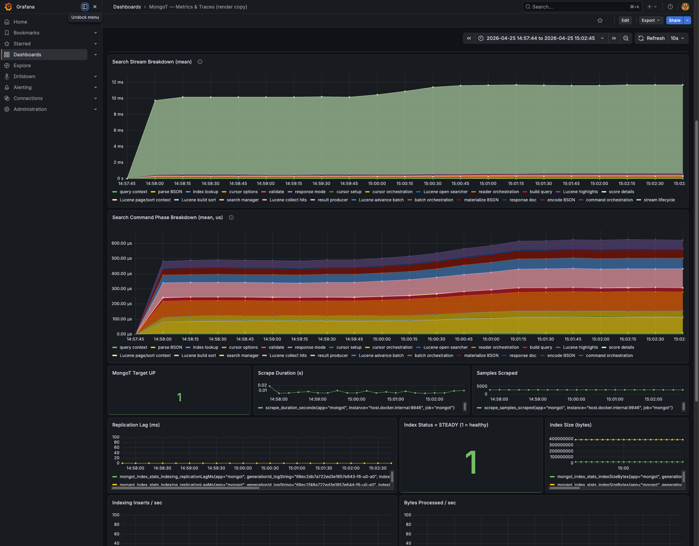

# MongoT search trace breakdown

Run window: 2026-04-25 14:57:44 to 2026-04-25 15:02:45 AEST.

Command:

```sh
k6 run -e K6_VUS=25 -e K6_DURATION=5m k6.js
```

Run summary:

| Metric | Value |
| --- | ---: |
| k6 requests | 301,112 |
| k6 throughput | 1,003.59 req/s |
| k6 failures | 0 |
| k6 HTTP median | 24.19 ms |
| k6 HTTP p95 | 32.54 ms |
| Jaeger traces sampled for this analysis | 2,000 |
| Trace query type | `collector` |
| Search index | `default` |
| Median stream span | 12.191 ms |
| Median `mongot.search.command` span | 428 us |



## Query And Index Shape

The k6 script calls `/image/search` without a `searchType`, so the Java app defaults to text search. The app builds a MongoDB aggregation with `$search`, a facet collector, a `compound.must` text clause on `caption`, optional `equals` filter clauses for `hasPerson` and COCO category fields, then `$skip`, `$limit`, and a final `$facet` to return both docs and `$$SEARCH_META`.

Relevant client code:

- [`k6.js`](../../../atlas-search-coco/k6.js)
- [`SearchRequest`](../../../atlas-search-coco/src/main/java/com/mycodefu/mongodb/search/SearchRequest.java)
- [`SearchPipelines`](../../../atlas-search-coco/src/main/java/com/mycodefu/mongodb/search/SearchPipelines.java)
- [`ImageDataAccess`](../../../atlas-search-coco/src/main/java/com/mycodefu/mongodb/ImageDataAccess.java)
- [`atlas-search-index.json`](../../../atlas-search-coco/src/main/resources/atlas-search-index.json)

The text index shape is:

- `caption`: `string`, used by the text operator.
- `hasPerson`: `boolean`, used by optional filter clauses.
- `accessory`, `animal`, `appliance`, `electronic`, `food`, `furniture`, `indoor`, `kitchen`, `outdoor`, `sports`, `vehicle`: each indexed as `token` and `stringFacet`, used by optional equality filters and facet buckets.
- Stored source includes `_id`, caption/image metadata, `hasPerson`, and the category arrays. Because k6 uses `includeLicense=false`, the app requests `returnStoredSource=true`.

The vector index is present in the app, but it was not used by this run because k6 did not send `searchType=Vector` or `searchType=Combined`.

## Timing Method

Segment timings below are medians computed from 2,000 Jaeger traces returned for the k6 window. Percentages are computed against the median full gRPC search stream span (`12.191 ms`) and the median in-command span (`428 us`). Some spans show `0 us` because the median is below Jaeger's microsecond precision or the operation is normally a no-op for this workload.

`stream lifecycle` is outside `mongot.search.command`. In this run it dominates the full stream span and includes gRPC stream lifetime, server response handling, driver/client consumption, and cursor work that happens after the initial command. In the sampled traces, outside-command `mongot.lucene.collect_more_top_docs` appeared in 1,496 traces with a median of `108 us`.

## Trace Segments

| Segment | Timing | Code | Description |
| --- | --- | --- | --- |
| query context | 6 us; 0.05% overall; 1.40% ex-stream | [`SearchCommand.run`](../../src/main/java/com/xgen/mongot/server/command/search/SearchCommand.java#L129), `OptimizationFlagsDefinition.toQueryOptimizationFlags`, `DynamicFeatureFlagRegistry.evaluateClusterInvariant` | Prepares per-query execution context before BSON query parsing. This resolves query optimization flags and the dynamic feature flag for the 10k bucket limit. I/O should be limited to in-memory config/feature flag reads. |
| parse BSON | 71 us; 0.58% overall; 16.59% ex-stream | [`SearchCommand.run`](../../src/main/java/com/xgen/mongot/server/command/search/SearchCommand.java#L168), [`SearchQuery.fromBson`](../../src/main/java/com/xgen/mongot/index/query/SearchQuery.java) | Parses the incoming `$search` BSON command body into MongoT query model objects. For this k6 workload the result is a collector query wrapping a text operator plus facet collectors. This is CPU parsing and validation work over the BSON document; it does not invoke Lucene. |
| index lookup | 1 us; 0.01% overall; 0.23% ex-stream | [`SearchCommand.run`](../../src/main/java/com/xgen/mongot/server/command/search/SearchCommand.java#L178), `SearchCommand.getIndexFromCatalog` | Looks up the named search index in MongoT's in-memory initialized index catalog and records whether it was found and how many partitions it has. The queried index was `default`. No Lucene call is made here. |
| cursor options | 0 us; 0.00% overall; 0.00% ex-stream | [`SearchCommand.run`](../../src/main/java/com/xgen/mongot/server/command/search/SearchCommand.java#L190), `CursorOptionsDefinition.toQueryCursorOptions` | Converts optional cursor options from the command into `QueryCursorOptions`. The k6 requests do not carry special cursor options, so the median is effectively zero. |
| validate | 0 us; 0.00% overall; 0.00% ex-stream | [`SearchCommand.validateQueryAndCursorOptions`](../../src/main/java/com/xgen/mongot/server/command/search/SearchCommand.java#L301) | Performs command-level validation, such as rejecting unsupported cursor options for vector search. The text facet workload takes the normal fast path. |
| response mode | 0 us; 0.00% overall; 0.00% ex-stream | [`SearchCommand.run`](../../src/main/java/com/xgen/mongot/server/command/search/SearchCommand.java#L202), `SearchCommand.addMetadataIfExplain`, `SearchCommand.determinePopulateCursor` | Sets up explain/dynamic-feature scopes, decides whether the response should include a cursor document, and adds metadata for explain when requested. The k6 requests are not explain requests. |
| cursor setup | 0 us; 0.00% overall; 0.00% ex-stream | [`MongotCursorManagerImpl.newCursor`](../../src/main/java/com/xgen/mongot/cursor/MongotCursorManagerImpl.java#L130), [`IndexCursorManagerImpl.createCursor`](../../src/main/java/com/xgen/mongot/cursor/IndexCursorManagerImpl.java#L83), [`CursorFactory.createCursor`](../../src/main/java/com/xgen/mongot/cursor/CursorFactory.java#L57), [`MongotCursor`](../../src/main/java/com/xgen/mongot/cursor/MongotCursor.java#L45) | Sum of the small cursor setup child spans: select index manager, choose batch size, instantiate cursor, register active cursor, and register the cursor-to-index mapping. These operations are in-memory bookkeeping and map writes. |
| cursor orchestration | 32 us; 0.26% overall; 7.48% ex-stream | [`MongotCursorManagerImpl.newCursor`](../../src/main/java/com/xgen/mongot/cursor/MongotCursorManagerImpl.java#L130), [`CursorFactory.createCursor`](../../src/main/java/com/xgen/mongot/cursor/CursorFactory.java#L57), [`IndexCursorManagerImpl.createCursor`](../../src/main/java/com/xgen/mongot/cursor/IndexCursorManagerImpl.java#L83) | Residual time inside cursor creation after subtracting explicit cursor setup and Lucene reader query spans. This covers read locks, `ensureOpen`, index availability/type checks, cursor ID allocation context, and handoff between cursor managers. |
| Lucene open searcher | 0 us; 0.00% overall; 0.00% ex-stream | [`LuceneSearchIndexReader.query`](../../src/main/java/com/xgen/mongot/index/lucene/LuceneSearchIndexReader.java#L249), [`LuceneIndexSearcherReference.create`](../../src/main/java/com/xgen/mongot/index/lucene/LuceneIndexSearcherReference.java#L102), [`LuceneSearcherManager`](../../src/main/java/com/xgen/mongot/index/lucene/searcher/LuceneSearcherManager.java) | Acquires a searcher reference over the current Lucene reader. This is the point where MongoT obtains an [`IndexSearcher`](https://lucene.apache.org/core/9_11_1/core/org/apache/lucene/search/IndexSearcher.html), which Lucene documents as the object that searches a single `IndexReader`. The median is zero because acquisition is normally a cheap reference operation. |
| reader orchestration | 89 us; 0.73% overall; 20.79% ex-stream | [`LuceneSearchIndexReader.query`](../../src/main/java/com/xgen/mongot/index/lucene/LuceneSearchIndexReader.java#L249), [`LuceneSearchIndexReader.operatorQuery`](../../src/main/java/com/xgen/mongot/index/lucene/LuceneSearchIndexReader.java#L631), [`LuceneSearchIndexReader.collectorQuery`](../../src/main/java/com/xgen/mongot/index/lucene/LuceneSearchIndexReader.java#L673) | Residual time inside the Lucene reader query path after subtracting named child spans. This includes stored-source checks, acquiring the shutdown shared lock, choosing the query branch, extracting the search operator from the collector query, and general method dispatch. It is mostly MongoT orchestration around Lucene state. |
| build query | 18 us; 0.15% overall; 4.21% ex-stream | [`LuceneSearchIndexReader.query`](../../src/main/java/com/xgen/mongot/index/lucene/LuceneSearchIndexReader.java#L317), [`LuceneSearchQueryFactoryDistributor.createQuery`](../../src/main/java/com/xgen/mongot/index/lucene/query/LuceneSearchQueryFactoryDistributor.java#L229), [`TextQueryFactory`](../../src/main/java/com/xgen/mongot/index/lucene/query/TextQueryFactory.java) | Converts the MongoT text/facet operator tree into Lucene [`Query`](https://lucene.apache.org/core/9_11_1/core/org/apache/lucene/search/Query.html) objects. This constructs Lucene query objects and may inspect the `IndexReader` for field/query context, but it does not execute the search. |
| Lucene highlights | 0 us; 0.00% overall; 0.00% ex-stream | [`LuceneHighlighterContext.getHighlighterIfPresent`](../../src/main/java/com/xgen/mongot/index/lucene/LuceneHighlighterContext.java), [`LuceneUnifiedHighlighter`](../../src/main/java/com/xgen/mongot/index/lucene/LuceneUnifiedHighlighter.java) | Prepares a Lucene highlighter when the query requests highlights. k6 does not request highlights, so the median is zero. When active, this uses Lucene's [`UnifiedHighlighter`](https://lucene.apache.org/core/9_11_1/highlighter/org/apache/lucene/search/uhighlight/UnifiedHighlighter.html), which derives highlighted passages from matching query terms and stored field values. |
| score details | 0 us; 0.00% overall; 0.00% ex-stream | [`LuceneScoreDetailsManager.getScoreDetailsManagerIfPresent`](../../src/main/java/com/xgen/mongot/index/lucene/LuceneScoreDetailsManager.java) | Prepares optional score-detail machinery. k6 does not request score details. When enabled during materialization, this can call Lucene [`IndexSearcher.explain(Query, int)`](https://lucene.apache.org/core/9_11_1/core/org/apache/lucene/search/IndexSearcher.html#explain(org.apache.lucene.search.Query,int)) to produce per-document scoring explanations. |
| Lucene page/sort context | 0 us; 0.00% overall; 0.00% ex-stream | [`LuceneSearchIndexReader.query`](../../src/main/java/com/xgen/mongot/index/lucene/LuceneSearchIndexReader.java#L361), [`IndexSortUtils.extractFirstIndexSort`](../../src/main/java/com/xgen/mongot/index/lucene/query/sort/IndexSortUtils.java) | Extracts pagination sequence token state and, if sorted indexes are enabled, reads index sort metadata from the Lucene [`IndexReader`](https://lucene.apache.org/core/9_11_1/core/org/apache/lucene/index/IndexReader.html). The k6 text/facet query does not show meaningful work here. |
| Lucene build sort | 0 us; 0.00% overall; 0.00% ex-stream | [`LuceneSearchIndexReader.query`](../../src/main/java/com/xgen/mongot/index/lucene/LuceneSearchIndexReader.java#L373), [`LuceneSearchQueryFactoryDistributor.createSort`](../../src/main/java/com/xgen/mongot/index/lucene/query/LuceneSearchQueryFactoryDistributor.java#L336), [`LuceneIndexSearcher.getFieldToSortableTypesMapping`](../../src/main/java/com/xgen/mongot/index/lucene/searcher/LuceneIndexSearcher.java#L241) | Builds an optional Lucene [`Sort`](https://lucene.apache.org/core/9_11_1/core/org/apache/lucene/search/Sort.html) for sorted queries. The k6 workload does not request sort, so this is usually empty. |
| search manager | 0 us; 0.00% overall; 0.00% ex-stream | [`LuceneSearchIndexReader.operatorQuery`](../../src/main/java/com/xgen/mongot/index/lucene/LuceneSearchIndexReader.java#L631), [`LuceneSearchManagerFactory`](../../src/main/java/com/xgen/mongot/index/lucene/LuceneSearchManagerFactory.java), [`LuceneOperatorSearchManager`](../../src/main/java/com/xgen/mongot/index/lucene/LuceneOperatorSearchManager.java) | Creates the MongoT search manager wrapper that owns the Lucene query, optional sort/search-after state, and count behavior. It does not itself execute Lucene; it prepares the object that will call Lucene in the collect phase. |
| Lucene collect hits | 88 us; 0.72% overall; 20.56% ex-stream | [`MeteredLuceneSearchManager.initialSearch`](../../src/main/java/com/xgen/mongot/index/lucene/MeteredLuceneSearchManager.java#L28), [`LuceneOperatorSearchManager.initialSearch`](../../src/main/java/com/xgen/mongot/index/lucene/LuceneOperatorSearchManager.java#L32), [`AbstractLuceneSearchManager.createCollectorManager`](../../src/main/java/com/xgen/mongot/index/lucene/AbstractLuceneSearchManager.java#L51) | Actual initial Lucene search execution. MongoT creates a `TopScoreDocCollectorManager` or `TopFieldCollectorManager`, then calls Lucene [`IndexSearcher.search(Query, CollectorManager)`](https://lucene.apache.org/core/9_11_1/core/org/apache/lucene/search/IndexSearcher.html#search(org.apache.lucene.search.Query,org.apache.lucene.search.CollectorManager)). Lucene walks the index segments, scores/matches the query, and returns [`TopDocs`](https://lucene.apache.org/core/9_11_1/core/org/apache/lucene/search/TopDocs.html) for the first batch. |
| result producer | 0 us; 0.00% overall; 0.00% ex-stream | [`LuceneSearchIndexReader.searchBatchProducer`](../../src/main/java/com/xgen/mongot/index/lucene/LuceneSearchIndexReader.java#L1275), [`ProjectFactory.build`](../../src/main/java/com/xgen/mongot/index/lucene/query/pushdown/project/ProjectFactory.java), [`LuceneSearchBatchProducer`](../../src/main/java/com/xgen/mongot/index/lucene/LuceneSearchBatchProducer.java#L121), [`LuceneMetaResultsBuilder`](../../src/main/java/com/xgen/mongot/index/lucene/LuceneMetaResultsBuilder.java) | Wires the initial Lucene `TopDocs` into a batch producer and builds metadata producers. This is mostly object construction and projection setup over the stored source definition. |
| Lucene advance batch | 5 us; 0.04% overall; 1.17% ex-stream | [`MongotCursor.getExplainDisabledNextBatch`](../../src/main/java/com/xgen/mongot/cursor/MongotCursor.java#L90), [`LuceneSearchBatchProducer.execute`](../../src/main/java/com/xgen/mongot/index/lucene/LuceneSearchBatchProducer.java#L167), [`AbstractLuceneSearchManager.getMoreTopDocs`](../../src/main/java/com/xgen/mongot/index/lucene/AbstractLuceneSearchManager.java#L33) | Advances the batch producer to the next set of Lucene hits. For the first command batch, it mostly wraps the initial `TopDocs` already collected by `Lucene collect hits`. On later getMore work in the same stream, it can call Lucene [`IndexSearcher.searchAfter`](https://lucene.apache.org/core/9_11_1/core/org/apache/lucene/search/IndexSearcher.html#searchAfter(org.apache.lucene.search.ScoreDoc,org.apache.lucene.search.Query,int)) to continue after the previous `ScoreDoc`. |
| batch orchestration | 14 us; 0.11% overall; 3.27% ex-stream | [`MongotCursorManagerImpl.getNextBatch`](../../src/main/java/com/xgen/mongot/cursor/MongotCursorManagerImpl.java#L226), [`IndexCursorManagerImpl.getNextBatch`](../../src/main/java/com/xgen/mongot/cursor/IndexCursorManagerImpl.java#L149), [`MongotCursor.getNextBatch`](../../src/main/java/com/xgen/mongot/cursor/MongotCursor.java#L67) | Residual batch-loading work after subtracting explicit advance and materialization spans. This covers cursor lookups, synchronization, batch-size adjustment, cursor state updates, exhaustion checks, and wrapping the result info. |
| materialize BSON | 33 us; 0.27% overall; 7.71% ex-stream | [`LuceneSearchBatchProducer.getSearchResultsFromIter`](../../src/main/java/com/xgen/mongot/index/lucene/LuceneSearchBatchProducer.java#L298), `SearchResultsIter.acceptAndAdvance`, [`ProjectStage.project`](../../src/main/java/com/xgen/mongot/index/lucene/query/pushdown/project/ProjectStage.java), [`MetaIdRetriever.getRootMetaId`](../../src/main/java/com/xgen/mongot/index/lucene/query/util/MetaIdRetriever.java) | Converts Lucene hits into MongoT BSON result documents. This may read stored fields for stored source projection and metadata. Lucene stored field access is via APIs under [`IndexReader.storedFields`](https://lucene.apache.org/core/9_11_1/core/org/apache/lucene/index/IndexReader.html#storedFields()) and [`StoredFields`](https://lucene.apache.org/core/9_11_1/core/org/apache/lucene/index/StoredFields.html). In this run the index returns stored source fields for image metadata and category arrays. |
| response doc | 7 us; 0.06% overall; 1.64% ex-stream | [`SearchCommand.getBatch`](../../src/main/java/com/xgen/mongot/server/command/search/SearchCommand.java#L317), [`MongotCursorBatch`](../../src/main/java/com/xgen/mongot/cursor/serialization/MongotCursorBatch.java) | Builds the command response wrapper, including optional cursor result and `$$SEARCH_META` variables. It also records the query batch timer sample. No Lucene work happens here. |
| encode BSON | 0 us; 0.00% overall; 0.00% ex-stream | [`SearchCommand.getBatch`](../../src/main/java/com/xgen/mongot/server/command/search/SearchCommand.java#L394), [`MongotCursorBatch.toBson`](../../src/main/java/com/xgen/mongot/cursor/serialization/MongotCursorBatch.java#L100) | Serializes the response wrapper into a BSON document to return through the command path. The median is below Jaeger precision for this workload. |
| command orchestration | 49 us; 0.40% overall; 11.45% ex-stream | [`SearchCommand.run`](../../src/main/java/com/xgen/mongot/server/command/search/SearchCommand.java#L129), [`SearchCommand.getBatch`](../../src/main/java/com/xgen/mongot/server/command/search/SearchCommand.java#L317), [`CursorGuard`](../../src/main/java/com/xgen/mongot/server/command/search/CursorGuard.java) | Residual time inside `mongot.search.command` after subtracting named command-phase segments. This includes root span setup/attributes, metrics increments, explain/feature flag scope management, cursor guard logic, branch handling, and normal return/error control flow. |
| stream lifecycle | 11.59 ms; 95.03% overall; n/a ex-stream | [`ServerCallHandler.onNext`](../../src/main/java/com/xgen/mongot/server/grpc/ServerCallHandler.java#L72), [`ServerCallHandler.handleMessage`](../../src/main/java/com/xgen/mongot/server/grpc/ServerCallHandler.java#L108), [`CommandManager`](../../src/main/java/com/xgen/mongot/server/grpc/CommandManager.java), [`CommandRegistry.streamLatencyTimer`](../../src/main/java/com/xgen/mongot/server/command/registry/CommandRegistry.java#L170) | Time in the gRPC stream outside the initial `mongot.search.command`. This includes command parsing/dispatch around the search command, response observer synchronization and serialization metrics, half-close/cancellation lifecycle, and client/driver stream consumption. In sampled traces it also includes follow-up cursor work, including `mongot.lucene.collect_more_top_docs`, which continues Lucene hit collection after the initial response when the driver consumes more results from the same search cursor. |

## Takeaways

The median in-command MongoT work is sub-millisecond, but the representative end-to-end stream span is not. For this k6 run, the full stream median is `12.191 ms`, while the initial `mongot.search.command` median is `428 us`. That means the dashboard's top stream panels are the better representation of user-visible MongoT stream latency, while the command phase panel explains what the fast in-command portion is made of.

Within the command span, the largest median contributors are `reader orchestration`, `Lucene collect hits`, `parse BSON`, `command orchestration`, and `materialize BSON`. The only row that directly performs the initial Lucene index query is `Lucene collect hits`; `Lucene advance batch` can perform Lucene `searchAfter` on later cursor batches, but the initial command batch usually advances over already-collected `TopDocs`.
