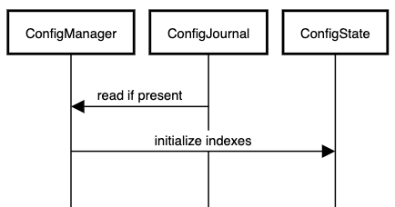
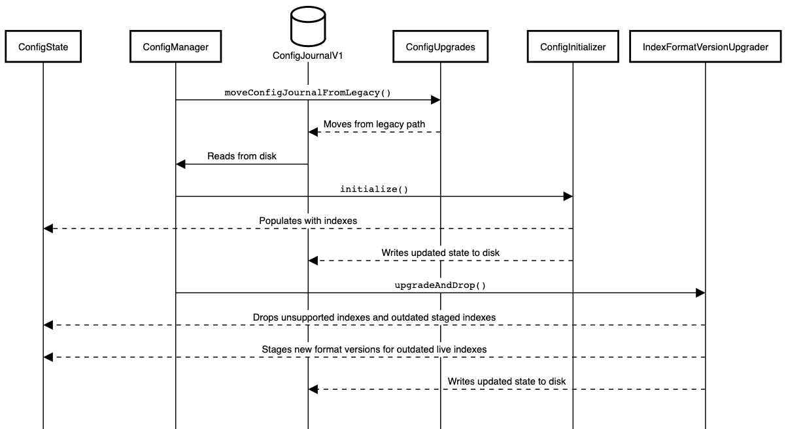

# Contents

- [Config Package](#config-package)
- [Config Manager](#config-manager)
    * [ConfigManager::update](#configmanagerupdate)
    * [Index Hot Swaps](#index-hot-swaps)
    * [Config Journals](#config-journals)
    * [Replication](#replication)
- [Development](#development)

# Config Package

The config package is responsible for the management of indexes. This includes the durable storage
of known indexes and their metadata, coordinating index replication, and management of index
generations.   
The [`provider.mms`](../../atlas/config/provider/mms/README.md) sub-package is responsible for all control plane
communications with `MMS`.

# Config Manager

The [`ConfigManager`](manager/ConfigManager.java) is in charge of taking a declarative list of
currently desired `IndexDefinition`s (normally the resolved valid ones from a `ConfCallResponse`).
And adjusting the state of the existing indexes to achieve the desired state.

The [`ConfigState`](manager/ConfigState.java) is the set of all existing indexes in various
lifecycle stages, replication, and cursor management.  
The concrete [`DefaultConfigManager`](manager/DefaultConfigManager.java) durably modifies
the `ConfigState` by writing [config journals](#config-journals) to disk. It is also in charge of
restoring previous existing indexes when `mongot` restarts as illustrated here:

During initialization and during an update cycle, the `DefaultConfigManager` serially delegates the
work on `ConfigState`. The rationale is that modifications on  `ConfigState` and the config journal
are incremental (for instance: "add one index" instead of "all these indexes should exist"). And so,
each handler that modifies `ConfigState` is safe from unintentionally corrupting parts of the state
that it isn't aware of.

## `DefaultConfigManager::initialize`

On initialization, `DefaultConfigManager` delegates various tasks to other classes, that abstract
the process of reading an on-disk journal, initializing existing indexes based on that journal,
starting their replication, and upgrading index format versions.

1. [`ConfigUpgrades`](manager/ConfigUpgrades.java) moves the config journal from the legacy path, if
   it exists.
2. The config journal is deserialized into a `ConfigJournalV1`.
3. [`ConfigInitializer`](manager/ConfigInitializer.java) creates a `ConfigState` and
   its `IndexGeneration`s based exactly on the contents of the config journal. This also starts
   replication of the journaled indexes.
4. [`IndexFormatVersionUpgrader`](manager/IndexFormatVersionUpgrader.java) handles index generations
   which differ from the current format version of this mongot. `IndexGeneration`s whose format
   versions are too old for replication are dropped, and we ensure any live `IndexGeneration`s which
   are out of date have new format versions staged.

A (non-inclusive) sequence of events on `DefaultConfigManager` initialization:

### Index Format Version Upgrader

If both a live and staged index exist for a given index ID, the following table enumerates the
action taken by `IndexFormatVersionUpgrader`, based on whether the live and staged index have a
unsupported, outdated, or current format version.

|                  Staged: | Unsupported                     | Outdated                        | Current                              |
|-------------------------:|---------------------------------|---------------------------------|--------------------------------------|
| **Live: Unsupported** | **L:** New **S:** None       | **L:** New **S:** None       | **L:** Old Staged **S:** None     |
|             **Outdated** | **L:** No Change **S:** New  | **L:** No Change **S:** New  | **L:** No Change **S:** No Change |
|              **Current** | **L:** No Change **S:** None | **L:** No Change **S:** None | **L:** No Change **S:** No Change |

## `ConfigManager::update`

When `DefaultConfigManager` receives a set of desired `IndexDefinition`s it performs several actions
on `ConfigState`.

1. Delegates the declarative list of `IndexDefinition`s
   to [`DesiredConfigStateUpdater`](manager/DesiredConfigStateUpdater.java) which in turn:
    - Formulates a change plan by comparing the desired `IndexDefinition`s to the existing ones.
    - Writes-ahead a journal with the planned changes to `ConfigState`
    - Modifies `ConfigState`
2. Delegates maintenance of stale indexes
   to [`IndexRecoveryStager`](manager/IndexRecoveryStager.java).
3. Delegates maintenance of index swaps
   to [`StagedIndexesSwapper`](manager/StagedIndexesSwapper.java)
   and [`PhasingOutIndexesDropper`](manager/PhasingOutIndexesDropper.java).

One config cycle in `ConfigManager`:

## Index Hot Swaps

To avoid downtime when users modify their `IndexDefinition`s, `DefaultConfigManager` builds indexes
in the background and places them in the `IndexCatalog` only when they reach steady state (the
indexes in `IndexCatalog` are the ones used to service queries). These swaps are also managed as a
part of the config cycle by [`StagedIndexesSwapper`](manager/StagedIndexesSwapper.java)
and [`PhasingOutIndexesDropper`](manager/PhasingOutIndexesDropper.java).

Hot swaps introduce a complexity where one index corresponding to a unique `ObjectId indexId` from
the `MMS` (and user) point of view actually has multiple `Index` instances in `mongot`. So the
config manager has to additionally assign a unique `Generation`, so that multiple `Index` instances
can be distinguished (for example: the current index and the staged index intended to replace it
have the same `indexId` but not the same `Generation`).

## Config Journals

Config journals are used to ensure that when `mongot` restarts, it can figure out what indexes it
had already created. This allows it to ensure that no indexes get orphaned.

If `mongot` did not write down the indexes it had created, the following series of events could
occur:

- `mongot` reads from `MMS` that it should create index A, and creates it
- `mongot` stops
- index A is removed in `MMS`
- `mongot` starts, and does not know that it had created index A, orphaning the index on disk

Instead, we write config journals prior to creating the index. Then, when `mongot` starts the second
time, it would see that it had an index called A. When it calls `MMS`, it would see that it needs to
delete index A.

### Legacy Config Journal
Mongot removed support for legacy config journals in [CLOUDP-138946](https://jira.mongodb.org/browse/CLOUDP-138946).
In the rare case that mongot is in a crash loop on startup and there exist log lines that include the following message: 

`"version" is required`

Request Cloud-Ops to manually delete the legacy config journal and corresponding index files in 
the customer's cluster. 

## Replication

The `DefaultConfigManager` is also responsible for starting and stopping replication for indexes in
a number of scenarios:

- When the `DefaultConfigManager` starts or stops, it will also start or stop replication for the
  indexes that it manages.
- When an index is added or dropped, the `DefaultConfigManager` will start or stop replication for
  that index.
- When the replication sync source changes, the `DefaultConfigManager` will stop replication for all
  managed indexes, switch to the new sync source, then restart replication for all managed indexes.
    - Note: Indexes that are closed cannot restart replication and the `DefaultConfigManager` will
      not re-register these indexes to be managed by the `ReplicationManager`.

# Development

The config package is a sensitive library in `mongot`. Programming errors are unrecoverable and will
cause `mongot` to [crash](https://jira.mongodb.org/browse/CLOUDP-65893). As such we encourage an
incremental release of features in a way that will allow `mongot` to be rolled back to the previous
release. This requires releases to
be [forwards compatible](https://aws.amazon.com/builders-library/ensuring-rollback-safety-during-deployments/).  
