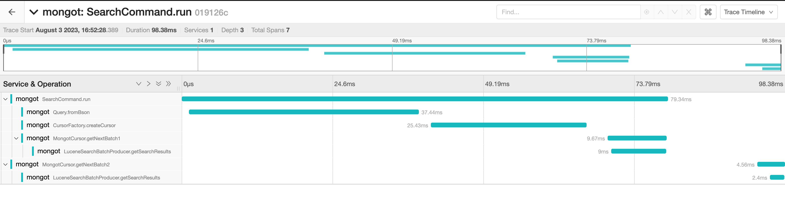
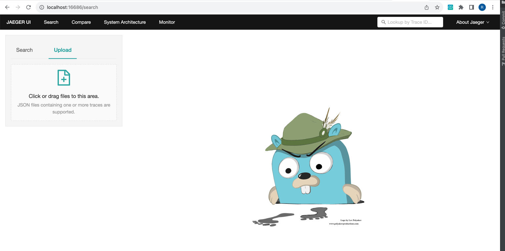

# OpenTelemetry Tracing

## Table of Contents

1. [Introduction](#introduction)
2. [Terminology](#terminology)
3. [Initializing tracing](#initializing-tracing)
4. [Instrumenting methods](#instrumenting-methods-using-tracing-library)
5. [Sampling of spans](#sampling-of-spans)
6. [Tracing Parser Overview](#tracing-parser-overview)
7. [How to test tracing](#how-to-test-tracing)
8. [FAQ - Instrumentation](#faq---instrumentation)
9. [Resources](#other-resources)

## Introduction

Tracing of mongot is done through
OpenTelemetry's [manual instrumentation](https://opentelemetry.io/docs/instrumentation/java/manual/).
With tracing, engineers are able to take advantage of traces to identify, visualize, and diagnose
technical issues.
Tracing is lightweight and does not significantly affect performance of mongot;
moreover, it can be turned off by default.

## Terminology

- **Trace**: a collection of linked spans, usually encapsulating one complete service request.
- **Span**: Object that represents an individual unit of operation. (e.g. function call)
    - Each has a start and end timestamp, and often linked attributes and metadata.
- **Context**: Data associated with a single span's execution. Generally used as a carrier to help
  propagate span-related info to remote services, to ensure continuity across multiple spans under a
  single trace.
- **Scope**: A programming construct which represents the "activation" or "deactivation" of
  contexts.
    - E.g. Must ensure that a parent span's scope is open for the creation of a child span to
      properly associate itself
      as the child of the parent span.

## Initializing tracing

At class loading time, the `Tracing` java class automatically initializes the global OpenTelemetry
tracer for mongot.

Notable configurations for the global tracer:

* Uses BatchSpanProcessor to group the export of multiple spans.
* The exporter of traces is a custom exporter, in `Slf4jExporter`. This is actually a replica of
  OpenTelemetry's [OtlpJsonLoggingSpanExporter](https://github.com/open-telemetry/opentelemetry-java/blob/d4a3b3b6806ddcd2becfae3f3160daed7aa0896b/exporters/logging-otlp/src/main/java/io/opentelemetry/exporter/logging/otlp/OtlpJsonLoggingSpanExporter.java),
  which exports collected spans to a Java util logger
  in [Logging OTLP JSON format](https://github.com/open-telemetry/opentelemetry-java/blob/main/sdk-extensions/autoconfigure/README.md#logging-otlp-json-exporter).
  The only difference with `Slf4jExporter` is that it routes the traces to a **Slf4j** logger, as
  mongot already uses
  Slf4j for its logs, thus making exported traces uniform with other logs.

## Instrumenting methods using `Tracing` library

The `Tracing` class provides an internal library of helper functions that streamlines the
instrumentation of tracing to
mongot. Most helper methods provide AutoCloseable objects, such as `SpanGuard`. `SpanGuard`s
wrap around a span and will automatically start a span, activate its scope, and at the end of the
try block safely de-activate the scope and end the span.

### Example 1 - simple span

Here we wrap a process with a simple span by directly using OpenTelemetry API:
(note that `TRACER` references the global tracer, which I have not shown its initialization for
brevity).

```
Span span = TRACER.spanBuilder("mySpan").startSpan();
try (Scope scope = span.makeCurrent()) { // open scope
  // do something
} finally {
  span.end();
}
```

Instead, we can use `Tracing.simpleSpanGuard`:

```
try (SpanGuard guard = Tracing.simpleSpanGuard("myTrace")) {
  // do something
}
```



```mermaid
gantt
        dateFormat  ss
        axisFormat %S

        title Simple Span

        section Trace 1
        Span : 00, 10
```

### Example 2 - nested spans

OpenTelemetry automatically nests a new span created within another span, so long as the parent (or
outer) span has
their
scope open. Because `Tracing.simpleSpanGuard` shown in example 1 automatically activates the span's
scope, you can
re-use
it for nesting spans.

Using `Tracing` library:

```
public static void method1() {
  try (SpanGuard g = Tracing.simpleSpanGuard("parent") {
    method2();
  }
} 

public static void method2() {
  try (SpanGuard g = Tracing.simpleSpanGuard("child") {
    // processes
  }
}
```



```mermaid
gantt
        dateFormat  ss
        axisFormat %S

        title Nested Spans

        section Trace 1
        parent :00, 10
        child :02, 10
```

### Example 3 - sibling spans

There are instances where you wish to connect many spans underneath one trace (i.e. one traceId).
This is normally
simple when spans are nested, since they automatically are all given the same traceId. However, if
the second is not
nested underneath the first span, there is no way for OpenTelemetry to assume that they are coupled,
and thus it will
simply give each span a different traceId.

Grouping additional spans underneath one trace is tricky using OpenTelemetry API. It is greatly
simplified
by using `Tracing.withTraceId`.

Example: Suppose we wish to span each GetMore call that is associated with the same CursorId
underneath a single trace.
We do not wish to nest subsequent spans underneath previous spans, as this is not a correct
representation of
GetMore calls.

Instrumenting with `Tracing.withTraceId`:

```
String cachedTraceId; TraceFlags cachedTraceFlags;

try(var getMore1 = Tracing.simpleSpanGuard("getMore1")) {
  cachedTraceId = guard.getSpan().getSpanContext().getTraceId();
  cachedTraceFlags = guard.getSpan().getSpanContext().getTraceFlags();
  // first GetMore operations
}

// later
try(var getMore2=Tracing.withTraceId("getMore2",cachedTraceId,cachedTraceFlags)){
  // second GetMore operations
}
```



```mermaid
gantt
        dateFormat  ss
        axisFormat %S

        title Sibling spans under one TraceId

        section Trace 1
        getMore1  : 00, 05
        getMore2 : 06, 10
```

If you wish to see how to directly perform this using OpenTelemetry API, you can
examine `Tracing.withTraceId`.

### Example 4 - long-life parent span

The traditional method of adding children underneath a parent span can be seen in example 2. This
example follow a more
unique and convoluted scenario which is usually not applicable.

There are instances where we may want a span to live for the lifetime of an object, which may happen
to overlap
with the creation of other extraneous spans. The correct implementation is to de-activate the object
span's scope, to
allow unrelated spans to be created in a new, unique trace, and then re-activate the object span's
scope whenever it is
necessary to create children spans underneath the object span.

Here's how this looks directly using OpenTelemetry API:

```
private final Span objectSpan; 
public myObject() {
  objectSpan = TRACER.spanBuilder("parent").startSpan();
}

public void child() {
  try (Scope pScope = parent.makeCurrent()) {
    Span child = TRACER.spanBuilder("child").startSpan();
    try (child.makeCurrent()) {
      // child process
    } finally {
      child.end();
    }
  }
}

synchronized void close() {
  this.objectSpan.end();
} 
```

Using `Tracing.childUnderActivatedParent`:

```
private final Span objectSpan; 
public myObject() {
  objectSpan = Tracing.unguardedSpan("parent");
}

public void child() {
  try (var guard = Tracing.childUnderActivatedParent(objectSpan,"child")) {
    // child process
  }
}

synchronized void close() {
  this.objectSpan.end();
} 
```



```mermaid
gantt
        dateFormat  ss
        axisFormat %S

        title Nested Spans

        section Trace 1
        parent :00, 10
        child : 04, 06
        child : 07, 09
        
        section Trace 2
        otherSpan : 01, 03
```

The above diagram showcases where a `myObject` was created, another class’ method was called, and
then
later the `child()` method was called twice, at separate times.

Note that because the method does not end the parent span itself, you are responsible for ending the
parent span.
Because the parent span is not automatically ended by a try block, this specific implementation is
not generally
recommended, and any implementation of this should be rigorously tested to ensure that all spans are
closed.

## Sampling of spans

Sampling refers to the control of the spans that you export from your service and to an
observability backend.

* If a span is not sampled, then the exporter will never send the span out, and it will not be
  visible to a
  visualization backend.
* Spans that are not sampled can still propagate their context (i.e. activate their scope), and have
  data be added to
  it.

Mongot's instance of OpenTelemetry configures sampling in a safe and controllable way:

* The default sampling rate is passed in as a double value from mms, and read into `MmsConfig`.
  Specifically, the
  parameter
  falls under `tracing.sampler.rate`. If no default value is read into `MmsConfig`, the default
  sampling rate will be
  set to 0.
* The global tracer uses a "parent-based" `ToggleSampler` for sampling, who's sampling decision is a
  result of the
  following conditionals (in order of precedence):
    1. Checks for parents. Any child span will make the same sampling decision as its parent. In
       other words,
       parents propagate their sampling decision to any and all of their children.
    2. If root span (no parents), check the span for a boolean "toggle" attribute which forces the
       span to sample / not
       sample.
    3. If the root span does not have the toggle attribute, the sampler's default behavior will be
       to sample based on
       the default sampling rate set by mms.

The `Tracing` class provides an easy way to add the toggle attribute:

```
try (var guard = Tracing.simpleSpanGuard("mySpan",Tracing.TOGGLE_ON)) {
  // do something
}
```

**Warning**: The ordering of decisions for the sampler is incredibly important, and
misremembering it can lead to unintended behavior.

* E.g.: You toggle on a span with `Tracing.TOGGLE_ON`, but the span is never actually traced,
  because
  the span is actually called within the context of a parent span who is not sampled. Thus, the
  parent span's
  decision to not sample is propagated down to the child.

See `Tracing` class for further documentation and methods on how to toggle sampling.

## Tracing Parser Overview

### Purpose

The log files are injected with traces in the OTLP JSON format. In order to visualize the traces on
Jaeger, `JsonConvertor` is a Java program that converts the OpenTelemetry trace format into one
that's compatible with Jaeger. For more information about these conversion rules, you can refer to
this [documentation](https://opentelemetry.io/docs/specs/otel/trace/sdk_exporters/jaeger/).

### Input and Output Format

The parser is passed in the path to the input log files with injected OTLP JSON traces. The output
Jaeger JSON files are generated by grouping together and separating spans by their `traceId`. The
name of the output file will be formatted as [traceId].json as a result, and placed in the root
directory `mongot`.

## How to test tracing

The easiest way to test that instrumented methods are being traced is by using a local Docker
instance.

1. Open up a local Docker instance for mongot, using the standard `make docker.up`
2. Run the required commands that will call the mongot functions you have instrumented.
3. Save the log files of the mongot docker container. One convenient method is just to pipe the log
   messages, and also remove any unnecessary messages that you see fit.
   E.g. `make docker.logs | grep -v ConfCaller | grep -v ConfApi > myLogs.txt`.
4. Run the parser on the log file by calling `make tracer.parse INPUT=[inputFilePath]` and
   replacing inputFilePath with the absolute path to where your `myLogs.txt` is saved
5. The output JSON files will be stored in the `mongot` root directory
6. Run the command `make jaeger.up` to open up an instance of Jaeger UI on port 16686, and
   navigate to `localhost:16686`.
   
7. Upload the output Jaeger JSON format files by clicking or dragging them into the option shown
   above.

## FAQ - Instrumentation

### How do I instrument code without using `Tracing`?

There is no requirement to using the `Tracing` class. It is only intended to remove the boilerplate
code
necessary around opening up spans and scopes.

OpenTelemetry's [doc page](https://opentelemetry.io/docs/instrumentation/java/manual/) on manual
instrumentation is a
great place to start to learn more.

### Opening/closing spans and scopes

In OpenTelemetry, the open/close state of a span and its scope are independent of each other. Here
are some common
questions,
and their corresponding answers that can be rationalized by this fact:

#### 1. How many times can you start/end a span?

Only once. Starting and ending a span signifies the start time and end time of a span, which can
only be
assigned once. Ending a span also signifies to the exporter that it is ready to be exported; Note
that once
exported, you will no longer be able to add attributes or data to the span.

#### 2. How many times can you activate/deactivate a scope?

Infinite. Activating a scope simply signifies that the scope's context should be propagated if
another span is
created within that span's scope.

#### 3. Can you activate a span's scope after the span has ended?

Yes.

#### 4. Can you activate an unsampled span's scope?

Yes. Consequently, you can make spans that are children of unsampled spans.

#### 5. How many scopes can be active at one time?

At most one. It wouldn't make sense if multiple were active; if a child span was created, how would
the child
know which span was their parent?

#### 6. Are spans and scopes required to be closed?

Absolutely required. They are Closeable objects which must be closed. Although errors will not be
thrown if they
remain open, it is bad practice to let them live on (possibly forever), and it can also cause
unintended tracing
behavior.

* The purpose of the `Tracing` class utilizing SpanGuards is because guards have been designed such
  that they
  guarantee the closure of spans and scopes.
* If you are not using spanGuards wrapped around your spans, then it your responsibility to close
  scopes and spans.

#### 7. How do I know what scope is currently active?

You can use `Span.current()`, which returns the span that has its scope open at that moment. It will
return an
invalid ("null") span if there are none that have an active scope.

### How do you add attributes to a span?

A span attribute is a key-value pair associated with a specific span, that usually carries helpful
information
about the process. The key is the name, and the value is the data.

There are two primary ways to add attributes to a span.

1. **Manually add an attribute using OpenTelemetry API**

E.g.: Adding cursorId as an attribute for a span wrapped around the `MongotCursor.getNextBatch`
method:

```
synchronized MongotCursorResultInfo getNextBatch(<parameters>)  {
  try (var guard = Tracing.simpleSpanGuard("getNextBatch")) {
    guard.getSpan().setAttribute("cursorId", this.id); 
    
    // processes
  }
}
```

2. **Add attributes at initialization of span.** You can do this by utilizing the `Tracing` classes'
   overloaded methods,
   which
   accept a set of attributes that will be attached to a created span.
    * **Note**: Attributes that affect sampling decisions (e.g. `Tracing.TOGGLE_ON`) will have an
      effect _if and only
      if_
      the attribute was added at initialization.

E.g.: Force-sampling a span with an attribute:

```
synchronized MongotCursorResultInfo getNextBatch(<parameters>) {
  try (var guard = Tracing.simpleSpanGuard("getNextBatch",
                                           Attributes.of(Tracing.TOGGLE_TRACE,true))) {
    // processes
  }
}
```

### How do you determine whether a span is sampled?

See the [Sampling of spans](#sampling-of-spans) section, on how to control sampling of spans.

### What are SpanGuards?

`SpanGuard` objects are a wrapper around `Span` objects which implement AutoCloseable. Thus, they
are used within the `Tracing` library to be able to offer simple ways to instrument your code,
without having to write the boilerplate code that handles the opening and closing of spans and
scopes. `SpanGuard`s do this by automatically starting a span, activating its scope, and at the end
of the try block safely de-activating the scope and ending the span. `SpanGuard`s are not able to be
created directly. Rather, utilize the helper methods in `Tracing`. Note that another AutoCloseable
wrapper is the `ParentScopeGuard`. You can read more about the class and its purpose in its
javadocs.

### How can I propagate a span's context to a different thread?

The most common use case of this is if you have an Executor that passes off a task
to a new thread.

Simply wrap your Executor or ExecutorService as
such ([source](https://stackoverflow.com/questions/74297077/how-to-propagate-open-telemetry-span-to-executor-threads-in-spring-boot-or-is-i)):

```
myExecutorService = Context.taskWrapping(myExecutorService); 
```

## Other Resources

More detailed information about traces, OpenTelemetry and Jaeger can be found at the following
links:

1. [Traces and spans in OpenTelemetry](https://opentelemetry.io/docs/concepts/signals/traces/)
2. [OTLP JSON to Jaeger JSON conversion rules](https://opentelemetry.io/docs/specs/otel/trace/sdk_exporters/jaeger/)
3. [Jaeger UI configuration options](https://www.jaegertracing.io/docs/1.12/frontend-ui/)
4. [OpenTelemetry documentation](https://opentelemetry.io/docs/)